# XCUITest Runner - Architecture & Implementation Guide

## Overview

XCUITest Runner は、iOS Simulator 上で動作する軽量 HTTP サーバーです。XCUITest プロセス内で起動し、Rust CLI (`agent-mobile`) からの HTTP リクエストを受けて XCUITest API を呼び出します。

従来の idb gRPC + idb_companion アーキテクチャを置き換え、**外部依存ゼロ**（Apple 標準フレームワークのみ）で iOS 自動化を実現します。

## System Architecture

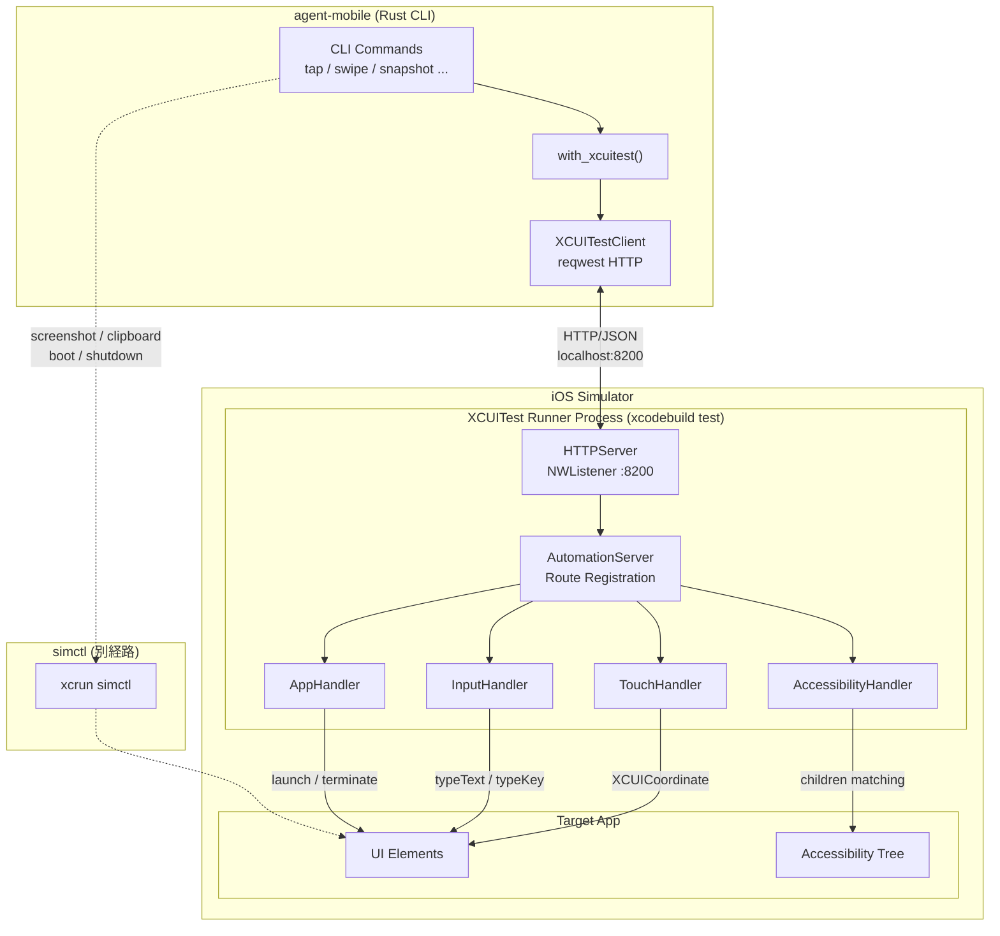

## Thread Model

XCUITest Runner の最も重要な設計上の制約は**スレッドモデル**です。

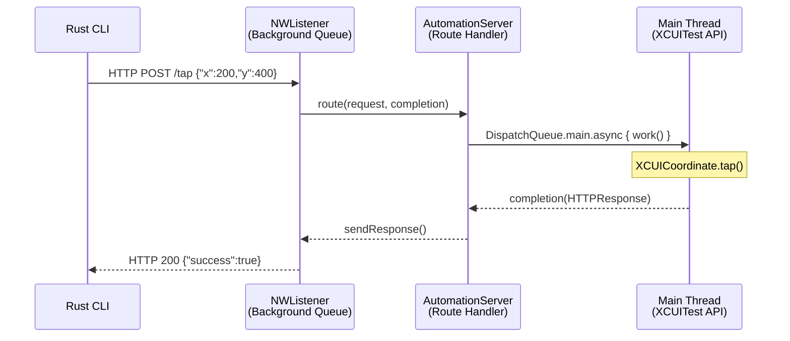

### Why Main Thread Dispatch?

| Component | Thread | Reason |
|-----------|--------|--------|
| NWListener | Background Queue | ネットワーク I/O はバックグラウンドで処理 |
| XCUITest API | **Main Thread Only** | Apple 制約: `XCUICoordinate.tap()` 等はメインスレッド必須 |
| RunLoop | Main Thread | テストを存続させつつメインスレッドのイベント処理を継続 |

**`onMain` ヘルパーパターン:**

```swift
private func onMain(
    _ work: @escaping () -> HTTPResponse,
    completion: @escaping (HTTPResponse) -> Void
) {
    DispatchQueue.main.async {
        let response = work()
        completion(response)
    }
}
```

> **Note:** `DispatchQueue.main.sync` は使用不可。メインスレッドが RunLoop で待機中のため、sync 呼び出しはデッドロックを引き起こします。

## Project Structure

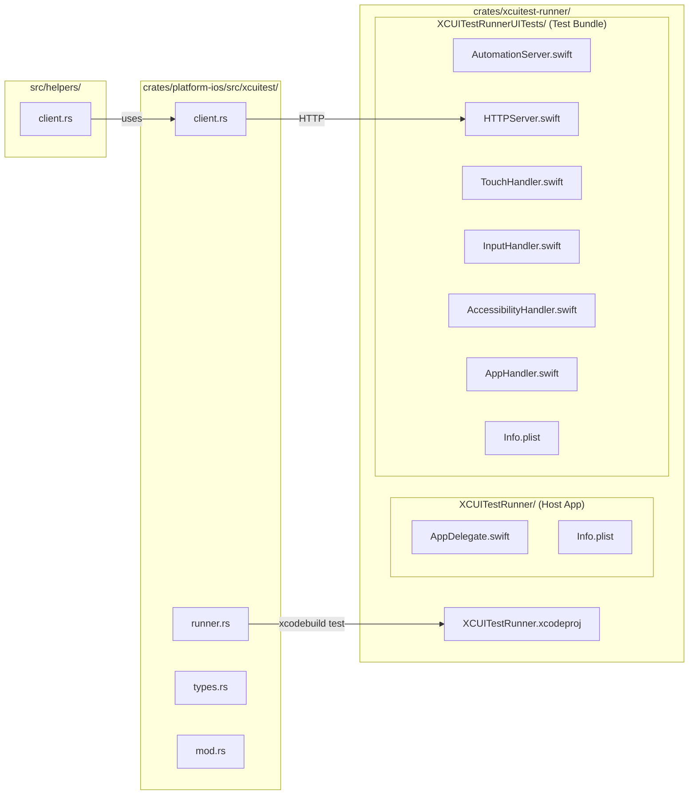

### File Roles

| File | Role | Layer |
|------|------|-------|
| `AutomationServer.swift` | テストエントリポイント + ルート登録 | Swift Server |
| `HTTPServer.swift` | NWListener ベース HTTP/1.1 サーバー | Swift Server |
| `TouchHandler.swift` | tap / swipe / long-press / button | Swift Handler |
| `InputHandler.swift` | text input / key press | Swift Handler |
| `AccessibilityHandler.swift` | Accessibility tree 取得 (idb 互換 JSON) | Swift Handler |
| `AppHandler.swift` | app launch / terminate | Swift Handler |
| `client.rs` | reqwest HTTP クライアント | Rust Client |
| `runner.rs` | xcodebuild プロセス管理 | Rust Client |
| `types.rs` | Request/Response serde 型定義 | Rust Client |
| `src/helpers/client.rs` | `with_xcuitest()` ヘルパー | Rust CLI |

## HTTP API Endpoints

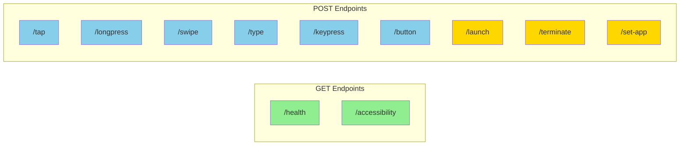

### Endpoint Details

#### Touch Operations

| Endpoint | Method | Body | XCUITest API |
|----------|--------|------|-------------|
| `/tap` | POST | `{"x": f64, "y": f64}` | `XCUICoordinate.tap()` |
| `/longpress` | POST | `{"x": f64, "y": f64, "duration": f64}` | `XCUICoordinate.press(forDuration:)` |
| `/swipe` | POST | `{"startX": f64, "startY": f64, "endX": f64, "endY": f64, "duration": f64}` | `coordinate.press(forDuration:thenDragTo:withVelocity:)` |

#### Input Operations

| Endpoint | Method | Body | XCUITest API |
|----------|--------|------|-------------|
| `/type` | POST | `{"text": "hello"}` | `XCUIElement.typeText()` |
| `/keypress` | POST | `{"key": "enter"}` | `XCUIElement.typeKey()` / `typeText()` |
| `/button` | POST | `{"button": "home"}` | `XCUIDevice.shared.press(.home)` |

**Key Mapping (`/keypress`):**

| Key Name | Mapping |
|----------|---------|
| `enter` / `return` | `\n` |
| `tab` | `\t` |
| `delete` / `backspace` | `.delete` |
| `escape` / `esc` | `.escape` |
| `space` | ` ` |
| `up` / `down` / `left` / `right` | Arrow keys |

#### Accessibility

| Endpoint | Method | Query Params | XCUITest API |
|----------|--------|-------------|-------------|
| `/accessibility` | GET | `?nested=true` (default) / `?nested=false` | Recursive `children(matching:)` traversal |

**Response Format (idb 互換):**

```json
{
  "type": "Button",
  "AXLabel": "Login",
  "AXValue": null,
  "frame": {"x": 100, "y": 200, "width": 80, "height": 44},
  "enabled": true,
  "children": []
}
```

#### App Management

| Endpoint | Method | Body | Effect |
|----------|--------|------|--------|
| `/launch` | POST | `{"bundleId": "com.apple.Settings"}` | Launch + handler context switch |
| `/terminate` | POST | `{"bundleId": "com.apple.Settings"}` | Terminate + revert to Springboard |
| `/set-app` | POST | `{"bundleId": "com.apple.Settings"}` | Context switch only (no launch) |

## Request/Response Lifecycle

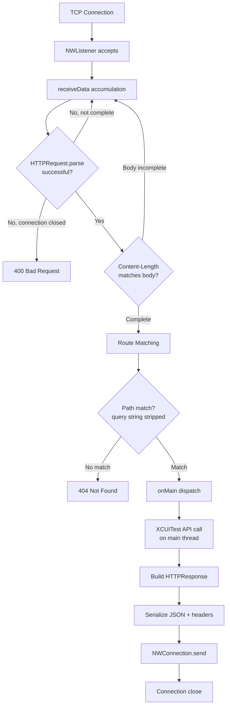

## HTTP Request Parsing

HTTP リクエストのパースは**バイトレベル**で実装されています。これは `String.distance` が文字数を返すため、マルチバイト文字を含むリクエストでオフセット計算が狂う問題を回避するためです。

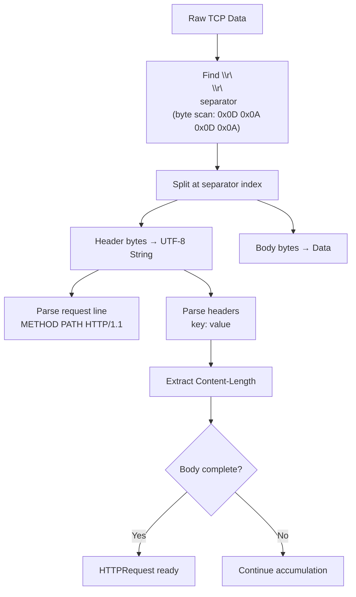

**Implementation detail:**

```swift
// Byte-level separator search (NOT string-based)
let separator: [UInt8] = [0x0D, 0x0A, 0x0D, 0x0A]
for i in 0...(data.count - 4) {
    if data[data.startIndex + i] == separator[0]
        && data[data.startIndex + i + 1] == separator[1]
        && data[data.startIndex + i + 2] == separator[2]
        && data[data.startIndex + i + 3] == separator[3] {
        separatorIndex = i
        break
    }
}
```

## App Context Switching

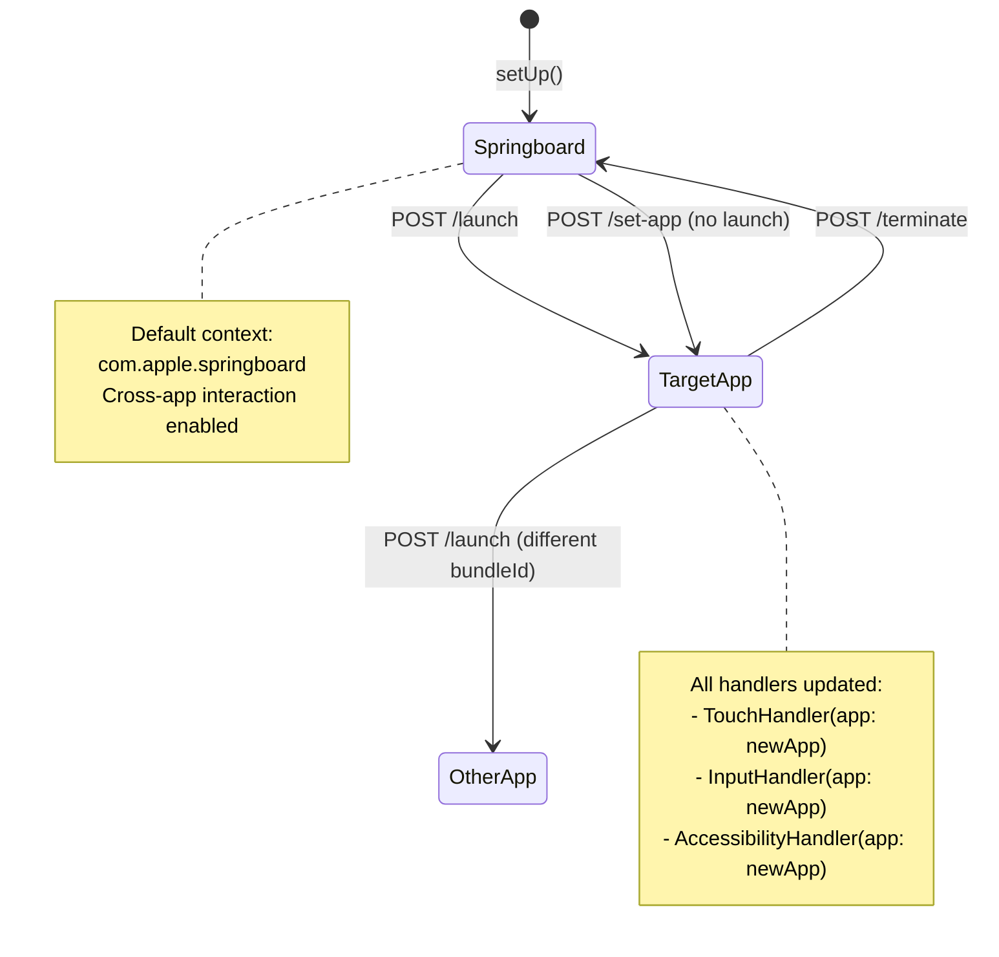

## Rust Client Architecture

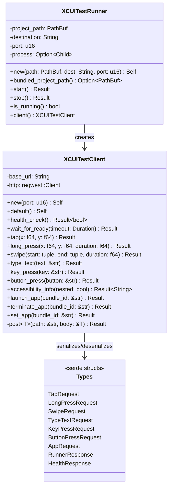

### Timeout Strategy

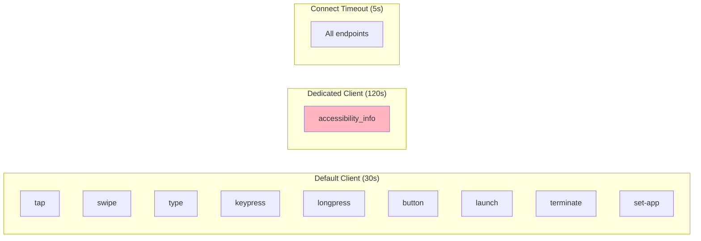

> Accessibility tree traversal は WebView を含むアプリで 60 秒以上かかるため、専用クライアント（120 秒タイムアウト）を使用します。

## Runner Lifecycle

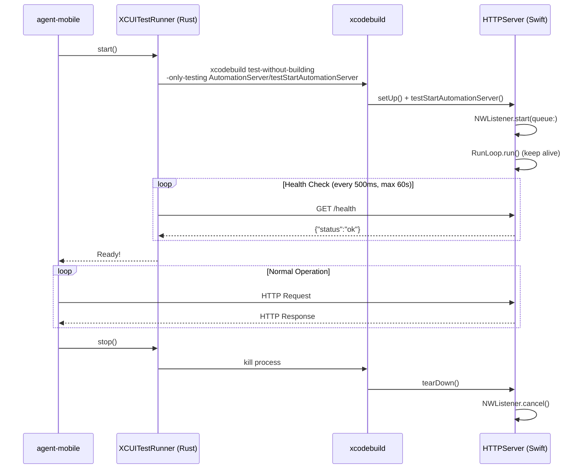

## Swipe Implementation Detail

スワイプは XCUITest の `press(forDuration:thenDragTo:withVelocity:)` を使用し、速度制御で精度を確保します。

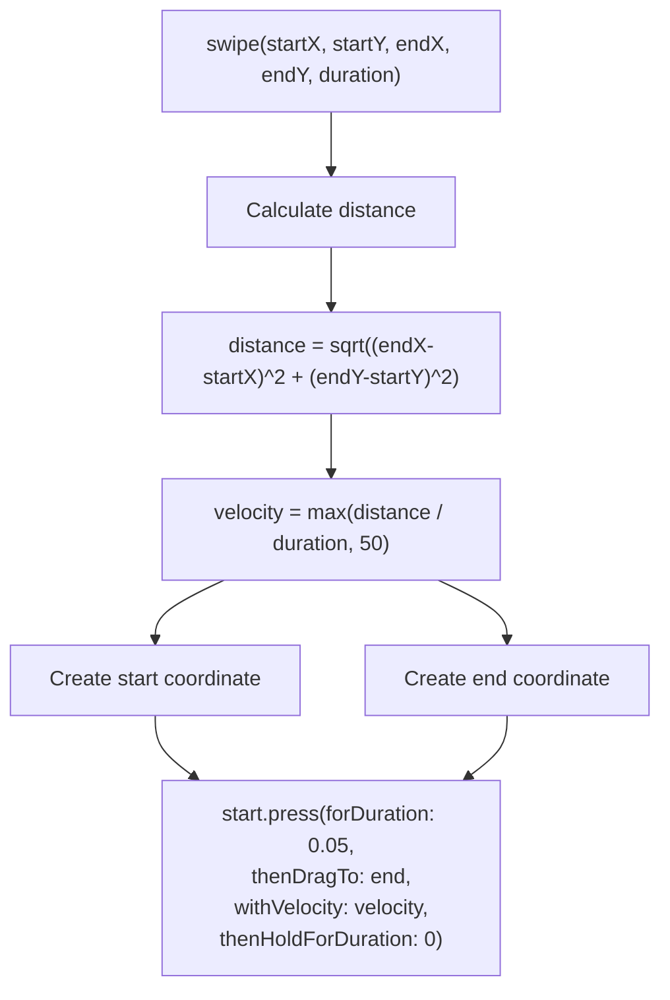

> `velocity` の最小値は 50 pts/sec。これより低いと XCUITest がスワイプを認識しない場合があります。

## Accessibility Tree Traversal

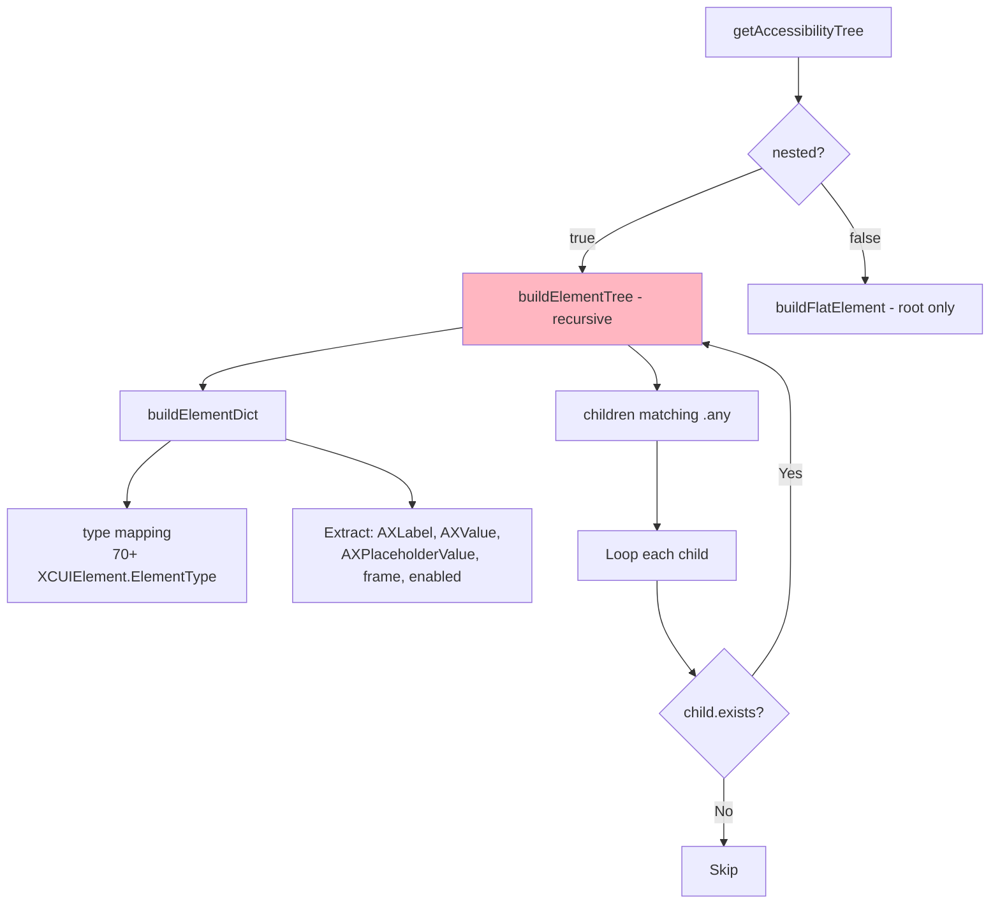

> **Performance Warning:** WebView を含むアプリでは、DOM 要素が Accessibility Tree に展開されるため、再帰走査が 60 秒以上かかる場合があります。`--no-scroll` オプションの使用を推奨します。

## Design Decisions

### Why NWListener (not GCDWebServer / Swifter)?

| Criteria | NWListener | GCDWebServer | Swifter |
|----------|-----------|-------------|---------|
| 外部依存 | **None** | CocoaPods/SPM | SPM |
| Apple 公式 | **Yes** | No | No |
| XCUITest 内動作 | **Verified** | Unverified | Unverified |
| HTTP/1.1 実装 | Manual | Built-in | Built-in |
| メンテナンス負担 | Medium | Low | Low |

**Decision:** 外部依存ゼロと Apple 公式フレームワークの安定性を優先。HTTP パースの手動実装コストは許容範囲内。

### Why HTTP/JSON (not gRPC / Unix Socket)?

| Criteria | HTTP/JSON | gRPC | Unix Socket |
|----------|----------|------|-------------|
| デバッグ容易性 | **curl で直接テスト可** | 専用ツール必要 | socat 等必要 |
| Rust 依存 | reqwest (軽量) | tonic+prost (重い) | tokio-uds |
| Swift 依存 | NWListener | SwiftGRPC | NWListener |
| パフォーマンス | Sufficient | Better | Better |
| 可読性 | **High** | Medium | Low |

**Decision:** デバッグ容易性と依存の軽さを優先。localhost 通信のため HTTP オーバーヘッドは無視できるレベル。

### Why Springboard as Default App?

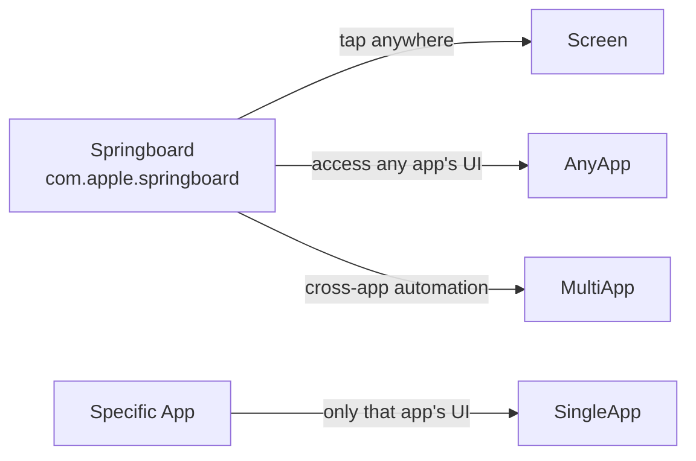

Springboard をデフォルトにすることで、`/launch` 前でもホーム画面操作やシステム UI との対話が可能になります。

## Known Issues & Limitations

| Issue | Severity | Workaround |
|-------|----------|------------|
| WebView accessibility traversal が遅い (60s+) | Medium | `--no-scroll` 使用、将来 `maxDepth` パラメータ追加予定 |
| Volume Up/Down ボタン非対応 | Low | Simulator では利用不可 |
| Lock/Siri ボタン非対応 | Low | XCUIDevice は `.home` のみ対応 |
| Runner 初回起動が遅い (xcodebuild) | Medium | 常駐プロセスとして運用 |
| Connection close per request | Low | HTTP Keep-Alive 未対応だがパフォーマンスへの影響は軽微 |

## Build & Run

### Prerequisites

- Xcode 16+ (iOS 16.0+ SDK)
- Booted iOS Simulator
- Rust toolchain (for agent-mobile CLI)

### Build XCUITest Runner

```bash
cd crates/xcuitest-runner
xcodebuild build-for-testing \
  -project XCUITestRunner.xcodeproj \
  -scheme XCUITestRunner \
  -destination 'platform=iOS Simulator,name=iPhone 16'
```

### Start Runner Manually

```bash
xcodebuild test-without-building \
  -project XCUITestRunner.xcodeproj \
  -scheme XCUITestRunner \
  -destination 'platform=iOS Simulator,name=iPhone 16' \
  -only-testing XCUITestRunnerUITests/AutomationServer/testStartAutomationServer
```

### Verify with curl

```bash
# Health check
curl http://localhost:8200/health

# Tap at (200, 400)
curl -X POST http://localhost:8200/tap \
  -H 'Content-Type: application/json' \
  -d '{"x": 200, "y": 400}'

# Get accessibility tree
curl http://localhost:8200/accessibility?nested=true
```
