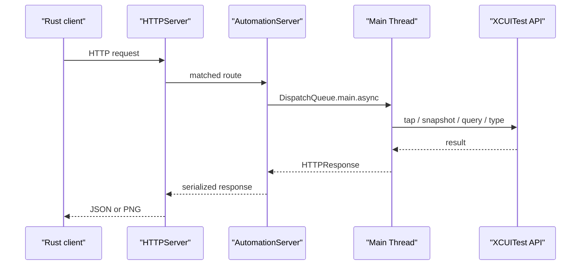

# xcuitest-runner Architecture

`xcuitest-runner` は iOS Simulator 内で動作する Swift/XCTest ベースの HTTP server です。`agent-mobile-platform-ios` からの HTTP request を受け、XCUITest API を main thread 上で実行します。

## 1. 目的

- Rust CLI から直接触れない XCUITest API を HTTP 越しに公開する
- iOS UI の操作、観測、clipboard、screenshot を simulator 内で実行する
- fast snapshot / fast query API を提供し、CLI の短い反復を支える

## 2. 主要コンポーネント

| コンポーネント | 主なファイル | 役割 |
| --- | --- | --- |
| test entrypoint | `XCUITestRunnerUITests/AutomationServer.swift` | server 起動、route 登録、context 管理 |
| HTTP server | `XCUITestRunnerUITests/HTTPServer.swift` | `NWListener` ベースの軽量 HTTP server |
| accessibility | `XCUITestRunnerUITests/AccessibilityHandler.swift` | snapshot、query、legacy accessibility tree |
| touch | `XCUITestRunnerUITests/TouchHandler.swift` | tap / long press / swipe / hardware button |
| input | `XCUITestRunnerUITests/InputHandler.swift` | type / keypress / clear-text |
| app | `XCUITestRunnerUITests/AppHandler.swift` | launch / terminate |
| screenshot | `XCUITestRunnerUITests/ScreenshotHandler.swift` | PNG screenshot |
| clipboard | `XCUITestRunnerUITests/ClipboardHandler.swift` | simulator clipboard |

## 3. 実行モデル

設計上の要点は次です。

- networking は `NWListener` の background queue で処理する
- XCUITest API は `DispatchQueue.main.async` 経由で main thread へ dispatch する
- `DispatchQueue.main.sync` は使わず、RunLoop を止めない
- 長時間の test は `testStartAutomationServer()` が 1 年 timeout の expectation を待つ形で維持する

## 4. App context 管理

`AutomationServer` は SpringBoard を neutral context として保持します。

- `setUp()` 直後の `app` は SpringBoard
- `activeBundleId` は `nil` から始まる
- `switchContext(to:)` が `XCUIApplication(bundleIdentifier:)` を作り直し、`AccessibilityHandler` / `TouchHandler` / `InputHandler` を差し替える
- `launch` と `set-app` は target app へ context を移し、`terminate` は SpringBoard へ戻す

この context は Rust 側の `app_context` 永続化と組み合わさって運用されます。

## 5. HTTP API 契約

エンドポイントは「メソッド・パス・入力・役割」が一覧で追いやすいように表にまとめています。

### Health / readiness

| メソッド | パス | 入力 | 役割 |
| --- | --- | --- | --- |
| `GET` | `/health` | — | HTTP server 自体が応答可能かを確認する |
| `GET` | `/ready` | — | `AccessibilityHandler.isReady()` を main thread で実行し、XCUITest API が使える状態かを確認する |

### Snapshot / query

| メソッド | パス | クエリ / ボディ | 役割 |
| --- | --- | --- | --- |
| `GET` | `/snapshot` | `depth`, `interactive_only`, `compact`, `visible_only`, `max_nodes` | fast snapshot（UI ツリーを取得） |
| `GET` | `/ui-hash` | `source`（`screenshot` / `accessibility`）, `depth`, `visible_only` | UI のハッシュ（変更検知用） |
| `POST` | `/query/first` | JSON: `QueryRequest` と同形 | 条件に最初の 1 件を返す |
| `POST` | `/query/exists` | JSON: `QueryRequest` と同形 | 条件の存在有無を返す |

`POST /query/*` の body は Rust 側 `QueryRequest` と一致します。

| フィールド | 意味 |
| --- | --- |
| `locator` | 探索に使う locator 種別 |
| `value` | locator に渡す値 |
| `exact` | 完全一致か |
| `caseSensitive` | 大文字小文字を区別するか |
| `visibleOnly` | 可視要素に限定するか |
| `maxDepth` | 走査の最大深さ |

### UI 操作

| メソッド | パス | 役割 |
| --- | --- | --- |
| `POST` | `/tap` | タップ |
| `POST` | `/longpress` | ロングプレス |
| `POST` | `/swipe` | スワイプ |
| `POST` | `/type` | 文字入力 |
| `POST` | `/keypress` | キー操作 |
| `POST` | `/clear-text` | テキストクリア |
| `POST` | `/button` | ハードウェアボタン等 |

成功時は基本的に `snapshotGeneration` を進めます。

### App / clipboard / screenshot

| メソッド | パス | 役割 |
| --- | --- | --- |
| `GET` | `/screenshot` | PNG スクリーンショット |
| `GET` | `/accessibility` | legacy accessibility tree |
| `POST` | `/launch` | アプリ起動（context 切替） |
| `POST` | `/terminate` | アプリ終了（SpringBoard へ戻す） |
| `POST` | `/set-app` | 対象アプリの切替 |
| `POST` | `/clipboard/copy` | クリップボードへコピー |
| `GET` | `/clipboard/paste` | クリップボードから取得 |
| `POST` | `/clipboard/clear` | クリップボードをクリア |

## 6. Accessibility と fast snapshot

`AccessibilityHandler` は 2 系統の観測 API を持ちます。

- legacy compatibility path
  - `getAccessibilityTree(nested:maxDepth:)`
  - nested tree / flat tree を返す
- fast path
  - `snapshotPayload(...)`
  - `queryFirst(...)`
  - `queryExists(...)`

fast path では `SnapshotElementModel` を flat payload として返します。Rust 側はこれを `RunnerSnapshotElement` に deserialize し、そこから `SnapshotElement` と `@eN` ref を構築します。

## 7. Rust 側との接続点

Rust 側の主な counterpart は `crates/platform-ios/src/xcuitest/` です。

- `client.rs`
  - endpoint ごとの request/response 変換
- `types.rs`
  - Swift が返す JSON shape と対応する型
- `runner.rs`
  - `xcodebuild` で本 runner を起動し `/ready` まで待つ

Swift 側が提供する contract は「HTTP transport」と「JSON/PNG payload shape」であり、CLI の locator 解決や session state 自体は Rust 側責務です。

## 8. 制約と設計判断

- simulator 内で XCUITest API を使う都合上、host command だけでは代替できない
- server は外部依存を持たず、`NWListener` と Foundation/XCTest のみで構成する
- fast snapshot / fast query は CLI の token 効率と待ち時間を改善するための専用 API
- SpringBoard を neutral context とすることで、absolute coordinate と app 切替の安定性を確保する
