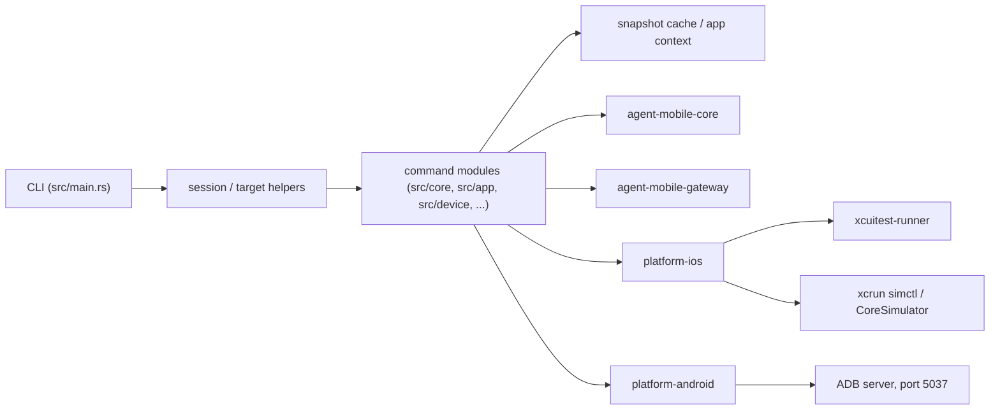

# agent-mobile Architecture

このドキュメントは `agent-mobile` CLI 全体の構造を、現行コードを基準に 0 ベースで整理したアーキテクチャの正本です。利用手順ではなく、責務分割、実行フロー、状態管理、platform 差分を把握するための文書として位置付けます。

## 1. 目的

`agent-mobile` は iOS Simulator と Android device/emulator を単一の CLI で操作するための Rust workspace です。主眼は次の 3 点です。

- AI エージェントが短いコマンドで UI を観測し、操作できること
- iOS と Android の実装差分を CLI 層の上ではできるだけ吸収すること
- session、snapshot cache、JSON 出力などを使って反復実行しやすくすること

## 2. ワークスペース構成

| レイヤ | 主なパス | 役割 |
| --- | --- | --- |
| CLI binary | `src/` | `clap` でコマンドを解釈し、session/target 解決、snapshot/ref 解決、出力整形を行う |
| shared core | `crates/core` | platform 非依存の型、trait、snapshot 基本型、出力 writer を提供する |
| gateway | `crates/gateway` | 薄い facade。platform detection、console streaming、Android 向け簡易 API を提供する |
| iOS backend | `crates/platform-ios` | `simctl`、CoreSimulator FFI、XCUITest Runner 管理、HTTP client、snapshot 抽出を担当する |
| Android backend | `crates/platform-android` | ADB native connection、shell command、UIAutomator dump、logcat streaming を担当する |
| iOS runner | `crates/xcuitest-runner` | Simulator 内で動く Swift 製 XCUITest HTTP server。iOS の UI 操作と観測を実行する |

## 3. 全体データフロー

典型的なコマンド実行は次の順で進みます。

1. `src/main.rs` が `Cli` を parse し、`Commands` に応じて実行モジュールへ分配する。
2. `--session` がある場合は `SessionResolver` が session を読み、未指定の `udid` を補完する。
3. `helpers::target` または `DeviceResolver` が platform と target UDID/serial を確定する。
4. UI 系コマンドは必要に応じて snapshot を取得し、`@eN` ref、text、座標、semantic locator を実際の element/coordinate に解決する。
5. backend が iOS または Android の具体的な transport を使って操作を実行する。
6. CLI 層が text / JSON / file 出力へ整形する。

## 4. 主要コマンド群の責務

### Core UI commands

`src/core/` は `tap`、`fill`、`find`、`wait`、`get`、`is`、`scroll`、`select` などの AI 向け UI command を持ちます。

- 入力は `@eN` ref、text、座標、semantic locator を受ける
- iOS は `XCUITestClient` の fast query / snapshot API を優先する
- Android は UIAutomator dump 由来の snapshot を元に解決し、ADB input 系 command を実行する

### Snapshot

`src/snapshot/` は CLI から見た UI 観測の中心です。

- iOS は runner の `/snapshot` と `/ui-hash` を使って flat snapshot を取得する
- Android は `uiautomator dump` を XML として取得し、共通 `Snapshot` へ変換する
- `ref_generator` が `@e1`, `@e2` を割り当てる
- `cache` が `/tmp/agent-mobile/snapshot-cache` 配下へ永続化する
- `collector` は scroll を挟みながら複数 view を統合し、見えていない要素も拾えるようにする

### App / Device / Session / Doctor / Console / Record

- `src/app.rs`: install / uninstall / launch / terminate / permission 管理
- `src/device.rs`: list / boot / shutdown / clipboard
- `src/session/`: session directory 上の state 管理と UDID 解決
- `src/doctor.rs`: host 環境に必要な外部依存の診断
- `src/console.rs`: log streaming。gateway を通して iOS/Android の差分を吸収
- `src/record.rs`: iOS は `simctl io recordVideo`、Android は device 上の `screenrecord`

## 5. 横断状態と補助レイヤ

### Session state

`src/session/state.rs` は session ごとの `session.json` を管理します。

- 既定保存先は `/tmp/agent-mobile/sessions`
- session 名から UDID、platform、active app、last snapshot を引ける
- `session.lock` による単純な file lock で同時更新を抑止する

### iOS app context

`src/session/app_context.rs` と `helpers::client.rs` は iOS 独自の app context 復元を担当します。

- runner は SpringBoard を neutral context として起動する
- `app launch` 後は last active app を永続化する
- 後続 command は `AppContextPolicy::RestoreIfUnset` を使い、runner に active app が無い場合だけ `set_app()` で復元する

### Output format

- text / JSON の選択は `helpers::format::OutputFormat`
- file / stdout / tee は `agent_mobile_core::io::OutputWriter`
- `snapshot`, `screenshot`, `console`, `record` は file 出力を持つ

### Ctrl+C を伴う長時間処理

`helpers::signal` の watch channel を使い、以下の command が停止シグナルを扱います。

- `console`
- `record`
- iOS runner 起動待ちや Android logcat のような継続処理

## 6. iOS と Android の差分

### iOS

iOS backend は hybrid 構成です。

- 端末管理、install/uninstall、boot/shutdown は `simctl` / CoreSimulator
- UI の tap、type、snapshot、query、clipboard は XCUITest Runner の HTTP API
- runner 起動は `platform-ios::xcuitest::runner` が `xcodebuild` を管理する

このため iOS の UI command は概ね次の流れになります。

1. `prepare_xcuitest_with_policy()` が対象 simulator と runner の readiness を保証する
2. 必要なら last active app を `set_app()` で復元する
3. `XCUITestClient` が `/snapshot`、`/query/first`、`/tap` などを呼ぶ
4. Swift runner が XCUITest API を main thread で実行する

### Android

Android backend は ADB server (`127.0.0.1:5037`) との直接通信が中心です。

- `AdbConnection` が ADB native protocol を扱う
- `adb::input` が tap / swipe / text / keyevent を shell command として発行する
- `adb::uiautomator` が XML dump を取り、snapshot 抽出に渡す
- `adb::logcat` は TCP で logcat を streaming する

CLI 層から見ると Android は daemon を追加起動せず、ADB server を既存前提で利用する設計です。

## 7. 設計上の判断

- CLI 層は thin ではなく orchestration layer。session、cache、locator 解決、platform 分岐を担う
- `gateway` は大きな抽象層ではなく、再利用価値の高い一部ロジックだけを持つ
- snapshot は共通の `Snapshot` 構造へ寄せるが、取得方法は iOS/Android で大きく異なる
- iOS の UI 自動化は XCUITest 制約に従うため、HTTP server を介した別プロセス構成を採る
- Android は ADB native connection に寄せ、可能な範囲で `adb` CLI 依存を減らす

## 8. 詳細ドキュメント

- [`crates/core/docs/ARCHITECTURE.md`](../crates/core/docs/ARCHITECTURE.md)
- [`crates/gateway/docs/ARCHITECTURE.md`](../crates/gateway/docs/ARCHITECTURE.md)
- [`crates/platform-ios/docs/ARCHITECTURE.md`](../crates/platform-ios/docs/ARCHITECTURE.md)
- [`crates/platform-android/docs/ARCHITECTURE.md`](../crates/platform-android/docs/ARCHITECTURE.md)
- [`crates/xcuitest-runner/docs/ARCHITECTURE.md`](../crates/xcuitest-runner/docs/ARCHITECTURE.md)
