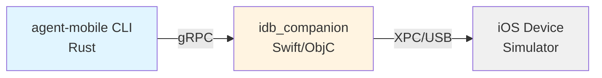
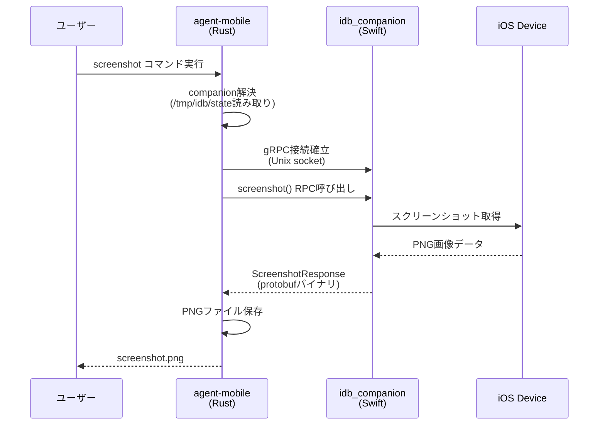
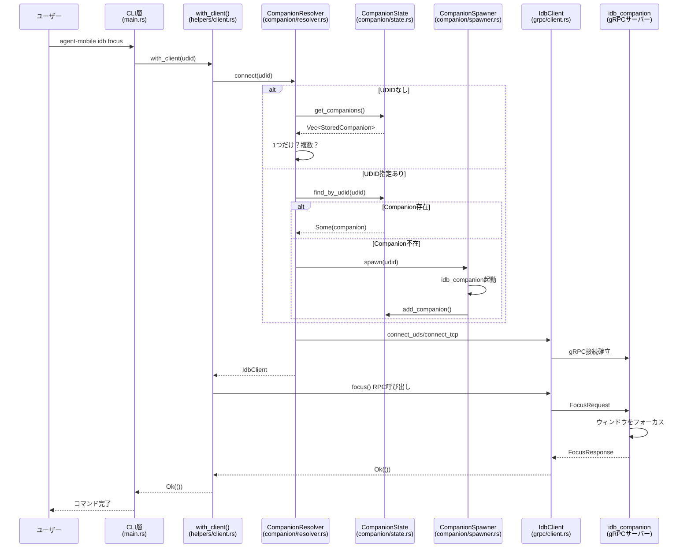
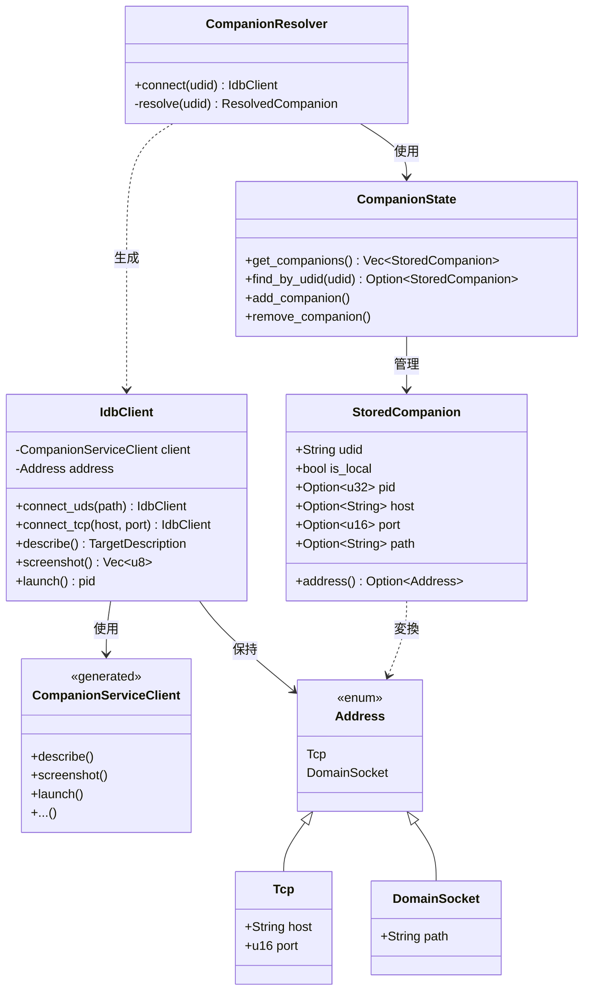
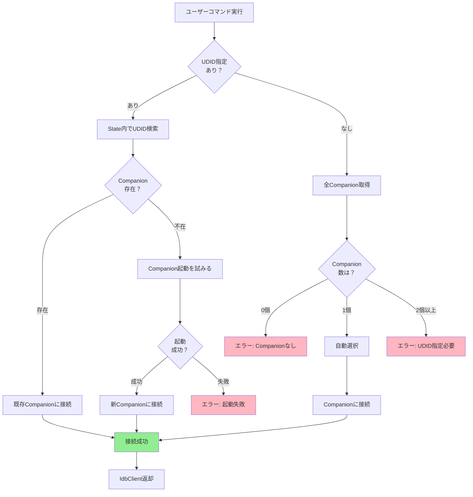
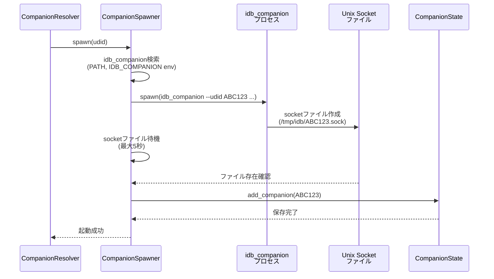
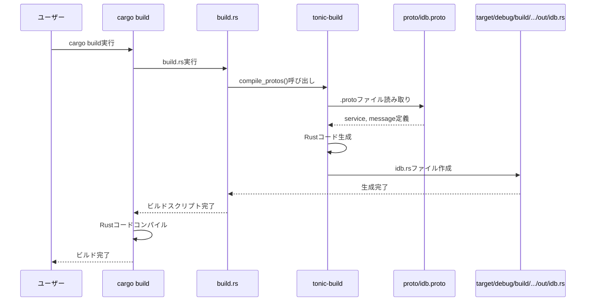

# agent-mobile gRPC通信ドキュメント

## 目次

1. [イントロダクション](#イントロダクション)
2. [gRPCとProtocol Buffersの基礎](#grpcとprotocol-buffersの基礎)
3. [アーキテクチャ概要](#アーキテクチャ概要)
4. [Protocol Buffers定義の読み方](#protocol-buffers定義の読み方)
5. [gRPC接続の仕組み](#grpc接続の仕組み)
6. [Companion管理システム](#companion管理システム)
7. [RPC通信パターンの実装](#rpc通信パターンの実装)
8. [CLI統合パターン](#cli統合パターン)
9. [build.rsとコード生成](#buildrsとコード生成)
10. [実装ガイド](#実装ガイド)
11. [トラブルシューティング](#トラブルシューティング)
12. [用語集](#用語集)
13. [参考資料](#参考資料)

---

## イントロダクション

### agent-mobileとは

`agent-mobile`は、FacebookのiOS Development Bridge（idb）のRust実装です。Python版のidb CLIをRustで再実装し、`idb_companion`デーモンとgRPCで通信することで、iOSデバイスやシミュレータの管理を高速かつ効率的に行います。

### システムアーキテクチャ



**コンポーネントの役割**:
- **agent-mobile CLI (Rust)**: ユーザーが実行するコマンドラインツール。gRPCクライアントとして動作
- **idb_companion (Swift/Objective-C)**: iOSデバイス/シミュレータと直接通信するデーモンプロセス。gRPCサーバーとして動作
- **iOS Device/Simulator**: 操作対象のiOSデバイスまたはシミュレータ

### なぜgRPCを使うのか

従来のHTTP/REST APIと比較して、gRPCには以下の利点があります:

| 特徴 | HTTP/REST API | gRPC |
|------|---------------|------|
| データ形式 | JSON (テキスト) | Protocol Buffers (バイナリ) |
| 速度 | 🐢 遅い | 🚀 高速 |
| 型安全性 | ❌ 実行時エラー | ✅ コンパイル時チェック |
| ストリーミング | ❌ 基本的に非対応 | ✅ 双方向ストリーミング対応 |
| コード生成 | 手動実装 | 自動生成 |

**日常的な例え**:
```
HTTP/REST API: 手紙のやり取り
  - 人間が読める文字で書く（JSON）
  - 封筒に入れて郵送
  - 返事が来るまで待つ

gRPC: 専用の高速通信回線
  - 効率的なバイナリで送る（protobuf）
  - 直接接続された回線で送受信
  - リアルタイムで双方向通信
```

### コマンド実行時の通信例

ユーザーがコマンドを実行すると、以下の流れでgRPC通信が行われます:

```bash
$ agent-mobile idb screenshot
```



### Python idbとの互換性

このRust実装は、Python版idbとコマンドライン互換性を保ちつつ、以下の改善を提供します:

**互換性**:
- 同じコマンド名とオプション
- 同じ出力フォーマット（JSON/人間が読める形式）
- 同じgRPCプロトコル（`idb_companion`との互換性）

**Rust実装の利点**:
- ⚡ 起動時間が高速（Python VMの起動不要）
- 🔒 メモリ安全性（Rustのオーナーシップシステム）
- 📦 単一バイナリ配布（依存関係の管理不要）
- 🚀 実行時のパフォーマンス向上

---

## gRPCとProtocol Buffersの基礎

### gRPCとは

**gRPC** (ジーアールピーシー) は、Googleが開発した高性能なRPC (Remote Procedure Call) フレームワークです。

#### RPCとは何か

**RPC (Remote Procedure Call: 遠隔手続き呼び出し)** は、別のプロセスやマシン上の関数を、ローカルの関数を呼ぶように実行できる仕組みです。

**例**:
```rust
// ローカル関数呼び出し
let result = calculate(5, 3);

// RPC呼び出し（見た目は同じ）
let result = remote_server.calculate(5, 3).await?;
```

実際には、ネットワーク越しにデータを送受信していますが、プログラマーからはローカル関数のように見えます。

#### なぜHTTP/RESTではなくgRPCなのか

1. **高速なバイナリ通信**
   - REST: JSONテキストを送信（`{"name":"iPhone 14","udid":"ABC123"}` = 約50バイト）
   - gRPC: protobufバイナリ（約20バイト、60%削減）

2. **厳密な型定義**
   - REST: APIドキュメントを読んで手動実装
   - gRPC: `.proto`ファイルから自動的にコード生成

3. **ストリーミング対応**
   - REST: リクエスト→レスポンスの1往復のみ
   - gRPC: 連続的なデータ送受信が可能（ログストリーミング、ファイル転送など）

4. **自動コード生成**
   - REST: クライアントコードを手動で書く
   - gRPC: protoファイルから自動生成

### Protocol Buffers (protobuf) とは

**Protocol Buffers** (プロトコルバッファ、protobuf) は、Googleが開発した効率的なデータシリアライゼーション形式です。

#### JSONとの違い

**JSON**:
```json
{
  "name": "iPhone 14 Pro",
  "udid": "ABC123-DEF456",
  "state": "Booted",
  "os_version": "iOS 16.0"
}
```
- ✅ 人間が読みやすい
- ❌ ファイルサイズが大きい（約100バイト）
- ❌ パース処理が遅い
- ❌ 型情報がない（実行時エラー）

**Protocol Buffers**:
```
[0x0a 0x0e 0x69 0x50 0x68 0x6f 0x6e 0x65 0x20 0x31 0x34 ...]
```
- ❌ 人間が読めない（バイナリ）
- ✅ ファイルサイズが小さい（約40バイト、60%削減）
- ✅ パース処理が高速
- ✅ 型情報あり（コンパイル時チェック）

#### `.proto`ファイルとは

`.proto`ファイルは、データ構造とAPIを定義する設計図です。言語に依存せず、ここから各言語のコードが自動生成されます。

**基本的な構造**:
```protobuf
// メッセージ型（データ構造）
message TargetDescription {
  string name = 1;        // フィールド番号1
  string udid = 2;        // フィールド番号2
  string state = 3;
  string os_version = 4;
}

// サービス定義（API）
service CompanionService {
  rpc describe(TargetDescriptionRequest) returns (TargetDescriptionResponse);
}
```

**ポイント**:
- `= 1`, `= 2`はフィールド番号（バイナリ通信で使用、変更不可）
- 1つのprotoファイルから、Rust、Python、Go、Java等のコードを生成可能

### 4つのRPC通信パターン

gRPCには4つの通信パターンがあります。それぞれ異なるユースケースに対応します。

#### 1. Unary RPC (単発リクエスト/レスポンス)

最もシンプルなパターン。通常の関数呼び出しと同じです。

```
Client: リクエスト1つ →
Server: ← レスポンス1つ
```

**ユースケース**:
- デバイス情報取得 (`describe`)
- スクリーンショット取得 (`screenshot`)
- ウィンドウをフォーカス (`focus`)

**例**:
```rust
// リクエスト送信
let response = client.screenshot().await?;
// レスポンス受信
let image_data = response.image_data;
```

#### 2. Server Streaming RPC (サーバーストリーミング)

クライアントが1つのリクエストを送り、サーバーから複数のレスポンスを連続的に受信します。

```
Client: リクエスト1つ →
Server: ← レスポンス1
        ← レスポンス2
        ← レスポンス3...
        ← (終了)
```

**ユースケース**:
- ログ出力 (`log`) - ログが継続的に流れてくる
- ファイルダウンロード (`pull`) - ファイルを分割して送信
- テスト実行 (`xctest_run`) - テスト結果が次々と返ってくる

**例**:
```rust
let mut stream = client.log().await?;
while let Some(log_line) = stream.message().await? {
    println!("{}", log_line);
}
```

#### 3. Client Streaming RPC (クライアントストリーミング)

クライアントが複数のリクエストを連続的に送信し、サーバーが1つのレスポンスを返します。

```
Client: リクエスト1 →
        リクエスト2 →
        リクエスト3 →
        (終了)
Server: ← レスポンス1つ
```

**ユースケース**:
- アプリインストール (`install`) - アプリファイルを分割して送信
- ファイルアップロード (`push`) - 大きなファイルを分割送信
- タッチイベント送信 (`hid`) - 連続したタッチ操作

**例**:
```rust
let (tx, rx) = mpsc::channel(32);
let stream = ReceiverStream::new(rx);

// ストリーム送信開始
let response = client.push(stream).await?;

// データを順次送信
tx.send(chunk1).await?;
tx.send(chunk2).await?;
// txをdropして終了
```

#### 4. Bidirectional Streaming RPC (双方向ストリーミング)

クライアントとサーバーが同時に複数のメッセージを送受信します。最も複雑ですが、最も強力なパターンです。

```
Client: リクエスト1 →
        リクエスト2 →    ← レスポンス1
        リクエスト3 →    ← レスポンス2
        (終了)           ← レスポンス3
                         ← (終了)
```

**ユースケース**:
- アプリ起動とログ受信 (`launch`) - 起動しながらログを受信、Ctrl+Cで停止送信
- ファイル監視 (`tail`) - ファイルを監視しながら、停止コマンドを送信可能

**例**:
```rust
let (tx, rx) = mpsc::channel(4);
let stream = ReceiverStream::new(rx);
let mut response_stream = client.launch(stream).await?;

loop {
    tokio::select! {
        // Ctrl+C検知
        _ = ctrl_c_signal => {
            tx.send(stop_request).await?;
            break;
        }
        // レスポンス受信
        msg = response_stream.message() => {
            println!("{:?}", msg);
        }
    }
}
```

### RustでgRPCを使う - tonicクレート

Rustでは**tonic**クレートを使ってgRPCを実装します。

**tonicの役割**:
- **tonic**: gRPCクライアント/サーバーの実装
- **tonic-build**: `.proto`ファイルからRustコードを自動生成
- **prost**: Protocol Buffersのシリアライゼーション/デシリアライゼーション

**Cargo.toml**:
```toml
[dependencies]
tonic = "0.10"
prost = "0.12"

[build-dependencies]
tonic-build = "0.10"
```

**使用例**:
```rust
// proto/idb.protoから生成されたコード
use crate::grpc::idb::{ScreenshotRequest, ScreenshotResponse};
use crate::grpc::idb::companion_service_client::CompanionServiceClient;

// gRPCクライアント作成
let mut client = CompanionServiceClient::new(channel);

// RPC呼び出し
let request = tonic::Request::new(ScreenshotRequest {});
let response = client.screenshot(request).await?;
let screenshot = response.into_inner();
```

---

## アーキテクチャ概要

このセクションでは、agent-mobile全体のアーキテクチャとgRPC通信フローを解説します。

### コマンド実行フロー

ユーザーがコマンドを実行してから結果が表示されるまでの流れを見ていきましょう。



**各コンポーネントの役割**:

1. **CLI層** (`src/main.rs`, `src/cli/`):
   - コマンドライン引数をパース
   - 適切なコマンド実装を呼び出し

2. **with_client()ヘルパー** (`src/cli/helpers/client.rs`):
   - companion解決と接続を抽象化
   - コマンド実装がgRPC通信の詳細を意識しなくて済む

3. **CompanionResolver** (`src/companion/resolver.rs`):
   - どのcompanionに接続すべきかを判断
   - UDID指定の有無、companion数に応じた処理分岐

4. **CompanionState** (`src/companion/state.rs`):
   - `/tmp/idb/state`ファイルの読み書き
   - 起動中のcompanion情報を管理

5. **CompanionSpawner** (`src/companion/spawner.rs`):
   - companionが起動していない場合に自動起動
   - socketファイル作成まで待機

6. **IdbClient** (`src/grpc/client.rs`):
   - gRPCクライアントの実装
   - 各RPCメソッドをRust関数として提供

7. **idb_companion** (Swift/Objective-C):
   - gRPCサーバーとして動作
   - iOSデバイス/シミュレータと直接通信

### 主要な型の関係



**型の説明**:

- **IdbClient**: gRPCクライアントのラッパー。各RPCメソッドをRust関数として提供
- **CompanionServiceClient**: protoから自動生成されたgRPCクライアント
- **Address**: 接続先を表すenum。Unix SocketまたはTCP
- **CompanionResolver**: 接続先companionの解決ロジック
- **CompanionState**: stateファイル（`/tmp/idb/state`）の読み書き
- **StoredCompanion**: stateファイルに保存されるcompanion情報

### ディレクトリ構造

```
agent-mobile/
├── src/
│   ├── main.rs                    # エントリーポイント
│   ├── cli/
│   │   ├── mod.rs                 # CLIコマンド定義
│   │   ├── idb/
│   │   │   ├── mod.rs             # idbサブコマンド定義
│   │   │   ├── list_targets.rs   # list-targetsコマンド実装
│   │   │   ├── screenshot.rs     # screenshotコマンド実装
│   │   │   ├── launch.rs         # launchコマンド実装
│   │   │   └── ...
│   │   └── helpers/
│   │       ├── mod.rs
│   │       └── client.rs          # with_client()ヘルパー
│   ├── grpc/
│   │   ├── mod.rs                 # protoコード読み込み
│   │   └── client.rs              # IdbClient実装
│   ├── companion/
│   │   ├── mod.rs
│   │   ├── state.rs               # CompanionState
│   │   ├── resolver.rs            # CompanionResolver
│   │   ├── spawner.rs             # CompanionSpawner
│   │   └── lister.rs              # CompanionLister
│   ├── types/
│   │   ├── mod.rs
│   │   └── target.rs              # Address, TargetDescription等
│   └── simctl/
│       └── mod.rs                 # xcrun simctl統合
├── proto/
│   └── idb.proto                  # Protocol Buffers定義
├── build.rs                       # ビルドスクリプト(proto→Rust)
└── tests/
    ├── file_ls_integration.rs     # 統合テスト
    └── ...
```

---

## Protocol Buffers定義の読み方

このセクションでは、`.proto`ファイルの基本構文と、agent-mobileで使用している`proto/idb.proto`の構造を解説します。

### .protoファイルの基本構文

Protocol Buffersファイルは、データ構造（メッセージ）とAPI（サービス）を定義します。

#### サービス定義

```protobuf
// サービス = APIの集合体
service CompanionService {
  // RPC = 1つの機能（関数のようなもの）
  rpc describe(TargetDescriptionRequest) returns (TargetDescriptionResponse);
  rpc screenshot(ScreenshotRequest) returns (ScreenshotResponse);
  rpc focus(FocusRequest) returns (FocusResponse);
}
```

**用語解説**:
- `service CompanionService`: このAPIの名前
- `rpc describe`: 関数名（デバイス情報取得）
- `(TargetDescriptionRequest)`: 引数の型（リクエストメッセージ）
- `returns (TargetDescriptionResponse)`: 戻り値の型（レスポンスメッセージ）

#### メッセージ定義

```protobuf
// メッセージ = データ構造（構造体のようなもの）
message TargetDescriptionRequest {
  bool fetch_diagnostics = 1;  // フィールド番号1
}

message TargetDescriptionResponse {
  TargetDescription target_description = 1;
  CompanionInfo companion = 2;
}

message TargetDescription {
  string udid = 1;            // デバイスID
  string name = 2;            // デバイス名（"iPhone 14 Pro"）
  string state = 4;           // 状態（"Booted", "Shutdown"）
  string target_type = 5;     // 種類（"simulator", "device"）
  string os_version = 6;      // OSバージョン（"iOS 16.0"）
  string architecture = 7;    // アーキテクチャ（"arm64", "x86_64"）
}
```

**用語解説**:
- `message`: データ構造の定義
- `string`, `bool`: データ型
- `= 1`, `= 2`: フィールド番号（**変更禁止**、バイナリ通信で使用）

**重要**: フィールド番号は一度決めたら変更できません。後から追加することは可能ですが、既存の番号を変えると互換性が壊れます。

#### データ型

| protobuf型 | Rust型 | 説明 |
|-----------|--------|------|
| `string` | `String` | UTF-8文字列 |
| `bool` | `bool` | 真偽値 |
| `int32` | `i32` | 32ビット整数 |
| `uint32` | `u32` | 32ビット符号なし整数 |
| `uint64` | `u64` | 64ビット符号なし整数 |
| `double` | `f64` | 倍精度浮動小数点数 |
| `bytes` | `Vec<u8>` | バイト列 |
| `repeated string` | `Vec<String>` | 文字列の配列 |

### idb.protoの全体像

`proto/idb.proto`は、idb_companionとの通信に使用されるすべてのRPCメソッドとメッセージ型を定義しています。

**ファイル位置**: `proto/idb.proto`

**主要セクション**:
```protobuf
syntax = "proto3";
package idb;

// ========== サービス定義 ==========
service CompanionService {
  // 約50個のRPCメソッド
}

// ========== 基本メッセージ ==========
message TargetDescription { ... }
message CompanionInfo { ... }

// ========== アプリ操作 ==========
message LaunchRequest { ... }
message InstallRequest { ... }

// ========== ファイル操作 ==========
message PullRequest { ... }
message PushRequest { ... }

// ========== その他 ==========
```

**主要なRPCメソッドの分類** (50以上のメソッドがあります):

#### Unary RPC (約30個)

単発のリクエスト/レスポンス。

```protobuf
service CompanionService {
  // デバイス情報
  rpc describe(TargetDescriptionRequest) returns (TargetDescriptionResponse);

  // スクリーンショット
  rpc screenshot(ScreenshotRequest) returns (ScreenshotResponse);

  // ウィンドウフォーカス
  rpc focus(FocusRequest) returns (FocusResponse);

  // URL開く
  rpc open_url(OpenUrlRequest) returns (OpenUrlResponse);

  // 位置情報設定
  rpc set_location(SetLocationRequest) returns (SetLocationResponse);

  // アプリ一覧
  rpc list_apps(ListAppsRequest) returns (ListAppsResponse);

  // アプリアンインストール
  rpc uninstall(UninstallRequest) returns (UninstallResponse);

  // アプリ終了
  rpc terminate(TerminateRequest) returns (TerminateResponse);

  // ファイル一覧
  rpc ls(LsRequest) returns (LsResponse);

  // ディレクトリ作成
  rpc mkdir(MkdirRequest) returns (MkdirResponse);

  // ファイル移動
  rpc mv(MvRequest) returns (MvResponse);

  // ファイル削除
  rpc rm(RmRequest) returns (RmResponse);

  // パーミッション許可
  rpc approve(ApproveRequest) returns (ApproveResponse);

  // パーミッション取り消し
  rpc revoke(RevokeRequest) returns (RevokeResponse);

  // プッシュ通知送信
  rpc send_notification(SendNotificationRequest) returns (SendNotificationResponse);

  // クラッシュログ一覧
  rpc crash_list(CrashLogQuery) returns (CrashLogResponse);

  // クラッシュログ削除
  rpc crash_delete(CrashLogQuery) returns (CrashLogResponse);

  // クラッシュログ表示
  rpc crash_show(CrashShowRequest) returns (CrashShowResponse);

  // XCTestバンドル一覧
  rpc xctest_list_bundles(XctestListBundlesRequest) returns (XctestListBundlesResponse);

  // XCTestテスト一覧
  rpc xctest_list_tests(XctestListTestsRequest) returns (XctestListTestsResponse);

  // 設定取得
  rpc get_setting(GetSettingRequest) returns (GetSettingResponse);

  // 設定一覧
  rpc list_settings(ListSettingRequest) returns (ListSettingResponse);

  // 設定変更
  rpc setting(SettingRequest) returns (SettingResponse);
}
```

#### Server Streaming RPC (約5個)

サーバーから複数のレスポンスを受信。

```protobuf
service CompanionService {
  // ログ出力（継続的にログが流れてくる）
  rpc log(LogRequest) returns (stream LogResponse);

  // ファイルダウンロード（ファイルを分割して受信）
  rpc pull(PullRequest) returns (stream PullResponse);

  // XCTestテスト実行（テスト結果が次々と返ってくる）
  rpc xctest_run(XctestRunRequest) returns (stream XctestRunResponse);
}
```

#### Client Streaming RPC (約5個)

クライアントから複数のリクエストを送信。

```protobuf
service CompanionService {
  // アプリインストール（アプリファイルを分割して送信）
  rpc install(stream InstallRequest) returns (stream InstallResponse);

  // ファイルアップロード（ファイルを分割して送信）
  rpc push(stream PushRequest) returns (PushResponse);

  // タッチイベント送信（連続したタッチ操作）
  rpc hid(stream HIDEvent) returns (HIDResponse);
}
```

#### Bidirectional Streaming RPC (約5個)

双方向で同時に複数のメッセージを送受信。

```protobuf
service CompanionService {
  // アプリ起動（起動しながらログを受信、Ctrl+Cで停止送信）
  rpc launch(stream LaunchRequest) returns (stream LaunchResponse);

  // ファイル監視（ファイルを監視しながら停止コマンドを送信可能）
  rpc tail(stream TailRequest) returns (stream TailResponse);
}
```

### ストリーミングの指定方法

`.proto`ファイルで`stream`キーワードを使うことで、ストリーミングRPCを定義します。

```protobuf
// Unary (通常のRPC)
rpc screenshot(ScreenshotRequest) returns (ScreenshotResponse);

// Server Streaming（サーバーから複数レスポンス）
//                                            ↓ streamキーワード
rpc log(LogRequest) returns (stream LogResponse);

// Client Streaming（クライアントから複数リクエスト）
//      ↓ streamキーワード
rpc push(stream PushRequest) returns (PushResponse);

// Bidirectional Streaming（両方にstream）
//        ↓                        ↓
rpc launch(stream LaunchRequest) returns (stream LaunchResponse);
```

**Rustコードへの変換**:

tonicは`stream`キーワードを見て、適切なRust型を生成します。

```rust
// Unary
async fn screenshot(&mut self, request: ScreenshotRequest)
    -> Result<ScreenshotResponse, Status>

// Server Streaming
async fn log(&mut self, request: LogRequest)
    -> Result<tonic::Streaming<LogResponse>, Status>
    //        ↑ ストリーム型

// Client Streaming
async fn push(&mut self, request: impl Stream<Item = PushRequest>)
    //                             ↑ ストリーム型を受け取る
    -> Result<PushResponse, Status>

// Bidirectional Streaming
async fn launch(&mut self, request: impl Stream<Item = LaunchRequest>)
    -> Result<tonic::Streaming<LaunchResponse>, Status>
    //        ↑ ストリーム型          ↑ ストリーム型
```

---

## gRPC接続の仕組み

このセクションでは、agent-mobileがidb_companionとgRPC接続を確立する方法を解説します。

### なぜUnix SocketとTCPの2種類があるのか

agent-mobileは、2種類の接続方法をサポートしています。

#### Unix Domain Socket (UDS)

**特徴**:
- 同じマシン内での通信専用
- ファイルパス経由で接続（例: `/tmp/idb/ABC123.sock`）
- 高速（カーネル内で完結、TCP/IPスタックを通らない）
- セキュア（ファイルパーミッションで制御）

**使用場面**:
- ローカルのiOSシミュレータ接続
- 同じマシン上のidb_companion

**イメージ**:
```
agent-mobile → /tmp/idb/ABC123.sock → idb_companion
  (Rust)        (Unixソケットファイル)      (Swift)

  同じマシン内での高速通信
```

#### TCP

**特徴**:
- ネットワーク越しの通信
- IPアドレス+ポート経由で接続（例: `192.168.1.100:10882`）
- リモートマシンとも通信可能
- 標準的なネットワークプロトコル

**使用場面**:
- 物理iOSデバイス（USBまたはネットワーク経由）
- リモートマシン上のidb_companion

**イメージ**:
```
agent-mobile → 192.168.1.100:10882 → idb_companion
  (Macbook)      (TCP/IP, ネットワーク)    (別マシン)

  ネットワーク越しの通信
```

### 接続確立 (Unix Domain Socket)

Unix Socketへの接続は、tonicとtokioの組み合わせで実現します。

**ファイル**: `src/grpc/client.rs:41-65`

**実装**:
```rust
use tokio::net::UnixStream;
use hyper_util::rt::TokioIo;
use tonic::transport::{Channel, Endpoint, Uri};
use tower::service_fn;

pub async fn connect_uds(
    socket_path: &str,
) -> Result<Self, Box<dyn std::error::Error + Send + Sync>> {
    let socket_path_owned = socket_path.to_string();

    // ダミーのURI（実際には使われない）
    let channel = Endpoint::try_from("http://[::]:50051")?
        .connect_with_connector(service_fn(move |_: Uri| {
            let path = socket_path_owned.clone();
            async move {
                // Unix Socketに接続
                let stream = UnixStream::connect(path).await?;
                // TokioIoでラップ（tonicが要求する型）
                Ok::<_, std::io::Error>(TokioIo::new(stream))
            }
        }))
        .await?;

    // gRPCクライアント作成
    let client = CompanionServiceClient::new(channel);

    Ok(Self {
        client,
        address: Address::DomainSocket {
            path: socket_path.to_string(),
        },
    })
}
```

**解説**:

1. **`Endpoint::try_from("http://[::]:50051")`**:
   - ダミーのURI。tonicのAPIが要求するが、実際には使われない
   - Unix Socketはファイルパスで接続するため、URIは不要

2. **`connect_with_connector`**:
   - カスタムの接続ロジックを提供
   - `service_fn`でクロージャをServiceトレイトに変換

3. **`UnixStream::connect(path)`**:
   - tokioの非同期Unix Socket接続
   - `/tmp/idb/ABC123.sock`のようなパスに接続

4. **`TokioIo::new(stream)`**:
   - UnixStreamをtonicが期待する型にラップ
   - hyper_utilが提供するアダプター

5. **`CompanionServiceClient::new(channel)`**:
   - protoから自動生成されたクライアント
   - 全RPCメソッドを持つ

**ポイント**: Unix Socket接続は少し複雑ですが、一度設定すれば非常に高速に通信できます。

### 接続確立 (TCP)

TCP接続はUnix Socketよりもシンプルです。

**ファイル**: `src/grpc/client.rs:68-83`

**実装**:
```rust
pub async fn connect_tcp(
    host: &str,
    port: u16,
) -> Result<Self, Box<dyn std::error::Error + Send + Sync>> {
    // httpスキーム + ホスト + ポート
    let addr = format!("http://{}:{}", host, port);

    // Channel作成と接続
    let channel = Channel::from_shared(addr)?
        .connect()
        .await?;

    // gRPCクライアント作成
    let client = CompanionServiceClient::new(channel);

    Ok(Self {
        client,
        address: Address::Tcp {
            host: host.to_string(),
            port,
        },
    })
}
```

**解説**:

1. **`format!("http://{}:{}", host, port)`**:
   - gRPCのURI作成（例: `http://192.168.1.100:10882`）
   - `http://`スキームを使用（HTTPSではない）

2. **`Channel::from_shared(addr)`**:
   - URIからChannelを作成
   - `from_shared`は`Arc`を使って共有可能

3. **`.connect().await`**:
   - 実際にTCP接続を確立
   - 接続失敗時はエラーを返す

**ポイント**: TCP接続は標準的なtonicの使い方で、特別な設定は不要です。

### tonicライブラリの基本的な使い方

tonicクレートは、gRPC通信を簡単に実装できるRustライブラリです。

#### リクエストの送り方

基本的なパターンは3ステップです。

```rust
// ステップ1: リクエストデータを作成
let request = tonic::Request::new(ScreenshotRequest {});

// ステップ2: gRPCメソッドを呼び出す（.awaitで結果を待つ）
let response = self.client.screenshot(request).await?;

// ステップ3: レスポンスからデータを取り出す
let inner = response.into_inner();
let image_data = inner.image_data; // Vec<u8>
```

#### 用語解説

- **`tonic::Request<T>`**:
  - gRPCリクエストのラッパー
  - メタデータ（ヘッダー等）も含む
  - `.new(data)`で作成

- **`tonic::Response<T>`**:
  - gRPCレスポンスのラッパー
  - メタデータ（ヘッダー等）も含む
  - `.into_inner()`で実際のデータを取得

- **`.into_inner()`**:
  - ラッパーを外して実際のデータを取得
  - `Response<ScreenshotResponse>` → `ScreenshotResponse`

- **`CompanionServiceClient`**:
  - protoから自動生成されたクライアント
  - 全RPCメソッドを持つ
  - 例: `screenshot()`, `describe()`, `launch()`等

#### 実際の使用例

**デバイス情報取得** (`describe` RPC):

**ファイル**: `src/grpc/client.rs:86-96`

```rust
pub async fn describe(
    &mut self,
    fetch_diagnostics: bool,
) -> Result<TargetDescription, Box<dyn std::error::Error + Send + Sync>> {
    // リクエスト作成
    let request = tonic::Request::new(TargetDescriptionRequest {
        fetch_diagnostics,
    });

    // RPC呼び出し
    let response = self.client.describe(request).await?;

    // レスポンスからデータ取得
    let inner = response.into_inner();

    // Rust型に変換
    self.target_from_response(inner)
}
```

**スクリーンショット取得** (`screenshot` RPC):

**ファイル**: `src/grpc/client.rs:252-259`

```rust
pub async fn screenshot(
    &mut self,
) -> Result<Vec<u8>, Box<dyn std::error::Error + Send + Sync>> {
    // リクエスト作成（空）
    let request = tonic::Request::new(ScreenshotRequest {});

    // RPC呼び出し
    let response = self.client.screenshot(request).await?;

    // PNG画像データを取得
    let inner = response.into_inner();
    Ok(inner.image_data)
}
```

**ウィンドウフォーカス** (`focus` RPC):

**ファイル**: `src/grpc/client.rs:262-267`

```rust
pub async fn focus(&mut self) -> Result<(), Box<dyn std::error::Error + Send + Sync>> {
    // リクエスト作成（空）
    let request = tonic::Request::new(super::idb::FocusRequest {});

    // RPC呼び出し
    let response = self.client.focus(request).await?;

    // レスポンスは使わない（成功/失敗のみ）
    let _inner = response.into_inner();
    Ok(())
}
```

---

## Companion管理システム

このセクションでは、「どのidb_companionに接続するか」を管理する仕組みを解説します。

### なぜCompanion管理が必要か

複数のiOSデバイス/シミュレータが接続されている場合:
- それぞれに対応するidb_companionプロセスが起動している
- agent-mobileは「どのcompanionに接続すべきか」を判断する必要がある
- ユーザーがUDIDを指定する場合と、自動選択する場合がある

**例**:
```bash
# UDID指定あり
$ agent-mobile idb --udid ABC123 screenshot

# UDID指定なし（1つだけなら自動選択）
$ agent-mobile idb screenshot
```

### State管理 - 接続情報の保存場所

起動中のcompanionの一覧は、`/tmp/idb/state`ファイルに保存されています。

#### Stateファイルの場所と形式

**ファイルパス**: `/tmp/idb/state`

**形式**: JSON配列

**例**:
```json
[
  {
    "udid": "ABC123-DEF456",
    "is_local": true,
    "path": "/tmp/idb/ABC123_companion.sock",
    "pid": 12345
  },
  {
    "udid": "XYZ789-GHI012",
    "is_local": false,
    "host": "192.168.1.100",
    "port": 10882,
    "pid": 54321
  }
]
```

**フィールドの説明**:
- `udid`: デバイスの一意識別子
- `is_local`: ローカルかリモートか
- `path`: Unix Socketパス（ローカルの場合）
- `host`, `port`: TCP接続情報（リモートの場合）
- `pid`: companionプロセスID

#### CompanionState実装

**ファイル**: `src/companion/state.rs`

**主要な構造体**:
```rust
#[derive(Debug, Clone, Serialize, Deserialize)]
pub struct StoredCompanion {
    pub udid: String,
    pub is_local: bool,
    #[serde(skip_serializing_if = "Option::is_none")]
    pub pid: Option<u32>,
    #[serde(skip_serializing_if = "Option::is_none")]
    pub host: Option<String>,
    #[serde(skip_serializing_if = "Option::is_none")]
    pub port: Option<u16>,
    #[serde(skip_serializing_if = "Option::is_none")]
    pub path: Option<String>,
}

impl StoredCompanion {
    /// 接続先情報をAddress型に変換
    pub fn address(&self) -> Option<Address> {
        if let Some(path) = &self.path {
            Some(Address::DomainSocket { path: path.clone() })
        } else if let (Some(host), Some(port)) = (&self.host, self.port) {
            Some(Address::Tcp {
                host: host.clone(),
                port,
            })
        } else {
            None
        }
    }
}
```

**CompanionStateの主要メソッド**:

```rust
pub struct CompanionState {
    state_path: PathBuf,
}

impl CompanionState {
    /// 全companion取得
    pub fn get_companions(&self) -> Vec<StoredCompanion> {
        // /tmp/idb/stateを読み取り
        // JSONパース
        // エラー時は空配列を返す
    }

    /// UDID指定でcompanion検索
    pub fn find_by_udid(&self, udid: &str) -> Option<StoredCompanion> {
        self.get_companions()
            .into_iter()
            .find(|c| c.udid == udid)
    }

    /// Companion追加/更新
    pub fn add_companion(&self, companion: StoredCompanion) -> Result<()> {
        let mut companions = self.get_companions();
        // 既存のUDIDがあれば更新、なければ追加
        companions.retain(|c| c.udid != companion.udid);
        companions.push(companion);
        self.save_companions(&companions)
    }

    /// Companion削除
    pub fn remove_companion(&self, udid: &str) -> Result<()> {
        let mut companions = self.get_companions();
        companions.retain(|c| c.udid != udid);
        self.save_companions(&companions)
    }

    /// 全Companion削除
    pub fn clear(&self) -> Result<()> {
        self.save_companions(&[])
    }
}
```

### Companion解決 (Resolver) - どのcompanionに接続するか判断

CompanionResolverは、ユーザーの指定とstateファイルの内容から、接続先companionを決定します。

**ファイル**: `src/companion/resolver.rs`

#### 解決ロジックのフローチャート



#### 実装例

**ファイル**: `src/companion/resolver.rs:88-160`

```rust
pub struct CompanionResolver {
    state: CompanionState,
    spawner: CompanionSpawner,
}

impl CompanionResolver {
    /// Companionに接続
    pub async fn connect(
        &self,
        udid: Option<&str>,
    ) -> Result<IdbClient, Box<dyn std::error::Error + Send + Sync>> {
        // Companion解決
        let resolved = self.resolve(udid)?;

        // 接続
        match resolved.address {
            Address::DomainSocket { path } => {
                IdbClient::connect_uds(&path).await
            }
            Address::Tcp { host, port } => {
                IdbClient::connect_tcp(&host, port).await
            }
        }
    }

    /// Companionを解決
    fn resolve(
        &self,
        udid: Option<&str>,
    ) -> Result<ResolvedCompanion, Box<dyn std::error::Error + Send + Sync>> {
        match udid {
            // UDID指定あり
            Some(udid) => {
                // State内で検索
                if let Some(companion) = self.state.find_by_udid(udid) {
                    // 既存Companionに接続
                    Ok(ResolvedCompanion {
                        udid: companion.udid.clone(),
                        address: companion.address()
                            .ok_or("Invalid companion address")?,
                    })
                } else {
                    // Companion起動を試みる
                    self.spawner.spawn(udid)?;

                    // 再度検索
                    let companion = self.state
                        .find_by_udid(udid)
                        .ok_or("Failed to spawn companion")?;

                    Ok(ResolvedCompanion {
                        udid: companion.udid.clone(),
                        address: companion.address()
                            .ok_or("Invalid companion address")?,
                    })
                }
            }

            // UDID指定なし
            None => {
                let companions = self.state.get_companions();

                match companions.len() {
                    0 => Err("No companions found. Please start idb_companion first.".into()),
                    1 => {
                        // 自動選択
                        let companion = &companions[0];
                        Ok(ResolvedCompanion {
                            udid: companion.udid.clone(),
                            address: companion.address()
                                .ok_or("Invalid companion address")?,
                        })
                    }
                    _ => Err(format!(
                        "Multiple companions found ({}). Please specify --udid",
                        companions.len()
                    ).into()),
                }
            }
        }
    }
}
```

**ポイント**:
- UDID指定ありの場合、companionが存在すればそのまま接続、存在しなければ起動を試みる
- UDID指定なしの場合、companionが1つだけなら自動選択、複数あればエラー
- エラーメッセージは明確で、ユーザーが次に何をすべきかがわかる

### Companion起動 (Spawner) - companionが起動していない場合

対象デバイスのcompanionが起動していない場合、自動的に起動します。

**ファイル**: `src/companion/spawner.rs`

#### 起動処理のフロー



#### 実装例

```rust
pub struct CompanionSpawner {
    state: CompanionState,
}

impl CompanionSpawner {
    /// Companionプロセスを起動
    pub fn spawn(&self, udid: &str) -> Result<(), Box<dyn std::error::Error + Send + Sync>> {
        // idb_companionバイナリを検索
        let companion_path = self.find_companion_binary()?;

        // Socket パス
        let socket_path = format!("/tmp/idb/{}_companion.sock", udid);

        // 既にsocketが存在するかチェック
        if Path::new(&socket_path).exists() {
            // 既に起動している可能性がある
            return Ok(());
        }

        // idb_companionプロセスを起動
        let mut cmd = Command::new(companion_path);
        cmd.arg("--udid").arg(udid);
        cmd.arg("--grpc-domain-sock").arg(&socket_path);
        cmd.stdout(Stdio::null());
        cmd.stderr(Stdio::null());

        let child = cmd.spawn()?;
        let pid = child.id();

        // Socketファイルが作成されるまで待機（最大5秒）
        for _ in 0..50 {
            if Path::new(&socket_path).exists() {
                // 成功: Stateに追加
                self.state.add_companion(StoredCompanion {
                    udid: udid.to_string(),
                    is_local: true,
                    pid: Some(pid),
                    path: Some(socket_path.clone()),
                    host: None,
                    port: None,
                })?;

                return Ok(());
            }
            thread::sleep(Duration::from_millis(100));
        }

        Err("Timeout waiting for companion socket".into())
    }

    /// idb_companionバイナリを検索
    fn find_companion_binary(&self) -> Result<PathBuf, Box<dyn std::error::Error + Send + Sync>> {
        // 1. 環境変数 IDB_COMPANION
        if let Ok(path) = env::var("IDB_COMPANION") {
            return Ok(PathBuf::from(path));
        }

        // 2. PATH内を検索
        if let Ok(path) = which("idb_companion") {
            return Ok(path);
        }

        // 3. 一般的な場所を検索
        let common_paths = [
            "/usr/local/bin/idb_companion",
            "/opt/homebrew/bin/idb_companion",
        ];

        for path in &common_paths {
            if Path::new(path).exists() {
                return Ok(PathBuf::from(path));
            }
        }

        Err("idb_companion not found in PATH".into())
    }
}
```

**起動コマンド例**:
```bash
idb_companion --udid ABC123-DEF456 --grpc-domain-sock /tmp/idb/ABC123_companion.sock
```

**ポイント**:
- `idb_companion`バイナリを環境変数やPATHから検索
- Socketファイルが作成されるまで待機（最大5秒）
- 起動成功後、stateファイルに登録

### Address型の設計 - 接続先を表現する型

Rustのenumで、2種類の接続方法をエレガントに表現します。

**ファイル**: `src/types/target.rs`

#### Address enum定義

```rust
use serde::{Deserialize, Serialize};

#[derive(Clone, Debug, Serialize, Deserialize, PartialEq)]
#[serde(untagged)]  // JSONで自動判別
pub enum Address {
    Tcp {
        host: String,
        port: u16,
    },
    DomainSocket {
        path: String,
    },
}
```

**`#[serde(untagged)]`の効果**:

通常のenum JSON:
```json
// tagged (デフォルト)
{
  "Tcp": {
    "host": "192.168.1.100",
    "port": 10882
  }
}
```

untagged enum JSON:
```json
// untagged
{
  "host": "192.168.1.100",
  "port": 10882
}
```

**メリット**:
- JSONがシンプルになる
- フィールドの有無で自動的に型を判別
- 既存のJSONフォーマットとの互換性

#### 実装例

```rust
impl Address {
    /// 表示用文字列
    pub fn to_string(&self) -> String {
        match self {
            Address::Tcp { host, port } => format!("{}:{}", host, port),
            Address::DomainSocket { path } => path.clone(),
        }
    }

    /// Unix Socketかどうか
    pub fn is_uds(&self) -> bool {
        matches!(self, Address::DomainSocket { .. })
    }

    /// TCPかどうか
    pub fn is_tcp(&self) -> bool {
        matches!(self, Address::Tcp { .. })
    }
}
```

#### 使用例

```rust
// Unix Socket
let addr = Address::DomainSocket {
    path: "/tmp/idb/ABC123.sock".to_string(),
};
let client = match addr {
    Address::DomainSocket { path } => IdbClient::connect_uds(&path).await?,
    Address::Tcp { host, port } => IdbClient::connect_tcp(&host, port).await?,
};

// TCP
let addr = Address::Tcp {
    host: "192.168.1.100".to_string(),
    port: 10882,
};
```

---

## RPC通信パターンの実装

このセクションでは、セクション2で説明した4つのRPC通信パターンを、実際のRustコードでどう実装するかを解説します。

### Unary RPC - 最もシンプルなパターン

Unary RPCは、リクエスト1つ、レスポンス1つの最もシンプルなパターンです。

**特徴**:
- 通常の関数呼び出しに近い感覚
- 同期的な処理に適している
- エラーハンドリングがシンプル

#### 実装パターン

**基本形**:
```rust
pub async fn method_name(
    &mut self,
    arg1: Type1,
    arg2: Type2,
) -> Result<ResponseType, Box<dyn std::error::Error + Send + Sync>> {
    // 1. リクエスト作成
    let request = tonic::Request::new(RequestMessage {
        field1: arg1,
        field2: arg2,
    });

    // 2. RPC呼び出し
    let response = self.client.method_name(request).await?;

    // 3. レスポンス取得
    let inner = response.into_inner();

    // 4. 必要に応じて変換
    Ok(transform(inner))
}
```

#### 実装例1: describe (デバイス情報取得)

**ファイル**: `src/grpc/client.rs:86-96`

```rust
/// デバイス情報を取得
pub async fn describe(
    &mut self,
    fetch_diagnostics: bool,
) -> Result<TargetDescription, Box<dyn std::error::Error + Send + Sync>> {
    // リクエスト作成
    let request = tonic::Request::new(TargetDescriptionRequest {
        fetch_diagnostics,
    });

    // RPC呼び出し
    let response = self.client.describe(request).await?;

    // レスポンス取得
    let inner = response.into_inner();

    // Rust型に変換
    self.target_from_response(inner)
}

fn target_from_response(
    &self,
    response: super::idb::TargetDescriptionResponse,
) -> Result<TargetDescription, Box<dyn std::error::Error + Send + Sync>> {
    let target = response
        .target_description
        .ok_or("Missing target_description in response")?;

    let companion = response.companion;

    let companion_info = companion.map(|c| CompanionInfo {
        udid: c.udid,
        is_local: c.is_local,
        pid: None,
        address: self.address.clone(),
    });

    Ok(TargetDescription {
        name: target.name,
        udid: target.udid,
        state: if target.state.is_empty() {
            None
        } else {
            Some(target.state)
        },
        target_type: TargetType::from_proto_string(&target.target_type),
        os_version: if target.os_version.is_empty() {
            None
        } else {
            Some(target.os_version)
        },
        architecture: if target.architecture.is_empty() {
            None
        } else {
            Some(target.architecture)
        },
        companion_info,
    })
}
```

#### 実装例2: screenshot (スクリーンショット取得)

**ファイル**: `src/grpc/client.rs:252-259`

```rust
/// スクリーンショットを取得
pub async fn screenshot(
    &mut self,
) -> Result<Vec<u8>, Box<dyn std::error::Error + Send + Sync>> {
    // リクエスト作成（引数なし）
    let request = tonic::Request::new(ScreenshotRequest {});

    // RPC呼び出し
    let response = self.client.screenshot(request).await?;

    // PNG画像データを取得
    let inner = response.into_inner();
    Ok(inner.image_data)  // Vec<u8>
}
```

#### 実装例3: focus (ウィンドウフォーカス)

**ファイル**: `src/grpc/client.rs:262-267`

```rust
/// シミュレータウィンドウをフォーカス
pub async fn focus(&mut self) -> Result<(), Box<dyn std::error::Error + Send + Sync>> {
    // リクエスト作成（引数なし）
    let request = tonic::Request::new(super::idb::FocusRequest {});

    // RPC呼び出し
    let response = self.client.focus(request).await?;

    // レスポンスは使わない（成功/失敗のみ）
    let _inner = response.into_inner();
    Ok(())
}
```

**ポイント**:
- 引数がない場合でも、空のリクエスト構造体を作成
- レスポンスを使わない場合でも、`into_inner()`は呼ぶ（所有権の移動）
- `?`演算子でエラーを自動伝播

### Server Streaming RPC - サーバーから連続データを受信

Server Streaming RPCは、リクエスト1つに対して、サーバーから複数のレスポンスを連続的に受信します。

**特徴**:
- ログ出力、ファイルダウンロード等に最適
- メモリ効率が良い（全データを一度にメモリに載せない）
- リアルタイム性が高い

#### ストリーム処理パターン

**基本形**:
```rust
pub async fn method_name(
    &mut self,
    args: Args,
) -> Result<(), Box<dyn std::error::Error + Send + Sync>> {
    // 1. リクエスト作成
    let request = tonic::Request::new(RequestMessage { ... });

    // 2. RPC呼び出し（Streamingを取得）
    let response = self.client.method_name(request).await?;
    let mut stream = response.into_inner();

    // 3. ストリームから次々とメッセージを受信
    while let Some(msg) = stream.message().await? {
        // 各メッセージを処理
        process(msg);
    }
    // ストリーム終了

    Ok(())
}
```

**用語解説**:
- `stream.message()`: 次のメッセージを取得。ない場合は`None`
- `while let Some(msg)`: `None`になるまでループ
- ストリームは自動的に閉じられる（Drop時）

#### 実装例1: log (ログ出力)

**ファイル**: `src/grpc/client.rs:476-514`

```rust
/// ログを出力（Server Streaming）
pub async fn log(
    &mut self,
    arguments: Vec<String>,
    source: LogSource,
) -> Result<(), Box<dyn std::error::Error + Send + Sync>> {
    // リクエスト作成
    let request = tonic::Request::new(LogRequest {
        arguments,
        source: source as i32,
    });

    // RPC呼び出し（Streamingを取得）
    let response = self.client.log(request).await?;
    let mut stream = response.into_inner();

    // ストリームから次々とログを受信
    while let Some(log_response) = stream.message().await? {
        // ログデータを標準出力に書き出し
        std::io::stdout().write_all(&log_response.output)?;
        std::io::stdout().flush()?;
    }

    Ok(())
}
```

**処理フロー**:
```
1. log()呼び出し
2. サーバーからログが流れ始める
   ← log line 1
   ← log line 2
   ← log line 3
   ...
3. ストリーム終了
```

#### 実装例2: pull (ファイルダウンロード)

**ファイル**: `src/grpc/client.rs:638-678`

```rust
/// ファイルをダウンロード（Server Streaming）
pub async fn pull(
    &mut self,
    src_path: String,
    dst_path: String,
    container: super::idb::FileContainer,
) -> Result<(), Box<dyn std::error::Error + Send + Sync>> {
    // リクエスト作成
    let request = tonic::Request::new(PullRequest {
        src_path,
        dst_path: dst_path.clone(),
        container: Some(container),
    });

    // RPC呼び出し（Streamingを取得）
    let response = self.client.pull(request).await?;
    let mut stream = response.into_inner();

    // ファイルを開く
    let mut file = std::fs::File::create(&dst_path)?;

    // ストリームから次々とチャンクを受信
    while let Some(pull_response) = stream.message().await? {
        if let Some(payload) = pull_response.payload {
            if let Some(source) = payload.source {
                match source {
                    // データチャンクを受信
                    PayloadSource::Data(data) => {
                        file.write_all(&data)?;
                    }
                    // ファイルパスを受信（稀）
                    PayloadSource::FilePath(path) => {
                        // ローカルファイルからコピー
                        std::fs::copy(path, &dst_path)?;
                    }
                    // その他の形式
                    _ => {}
                }
            }
        }
    }

    Ok(())
}
```

**処理フロー**:
```
1. pull()呼び出し
2. サーバーからファイルデータが分割して送られてくる
   ← chunk 1 (1MB)
   ← chunk 2 (1MB)
   ← chunk 3 (512KB)
3. ストリーム終了
4. ファイル完成
```

**ポイント**:
- 大きなファイルでもメモリに載せない（ストリーミング）
- 受信したデータを逐次ファイルに書き込む

### Client Streaming RPC - クライアントから連続データを送信

Client Streaming RPCは、クライアントから複数のリクエストを連続的に送信し、サーバーが1つのレスポンスを返します。

**特徴**:
- ファイルアップロード、連続した操作の送信に最適
- メモリ効率が良い（全データを一度にメモリに載せない）

#### ストリーム送信パターン

**基本形**:
```rust
use tokio::sync::mpsc;
use tokio_stream::wrappers::ReceiverStream;

pub async fn method_name(
    &mut self,
    data: Vec<DataChunk>,
) -> Result<Response, Box<dyn std::error::Error + Send + Sync>> {
    // 1. チャネル作成
    let (tx, rx) = mpsc::channel::<RequestMessage>(32);

    // 2. 受信側をストリームに変換
    let stream = ReceiverStream::new(rx);

    // 3. RPC呼び出し（ストリームを渡す）
    let response_future = self.client.method_name(stream);

    // 4. 別のタスクで送信
    tokio::spawn(async move {
        for chunk in data {
            tx.send(chunk).await.unwrap();
        }
        // txをdropすると送信終了
    });

    // 5. レスポンスを待つ
    let response = response_future.await?;
    Ok(response.into_inner())
}
```

**用語解説**:
- `mpsc::channel`: 非同期チャネル（Multiple Producer, Single Consumer）
- `ReceiverStream`: チャネルの受信側をStreamトレイトに変換
- `tokio::spawn`: 別の非同期タスクを起動

#### 実装例1: push (ファイルアップロード)

**ファイル**: `src/grpc/client.rs:578-636`

```rust
/// ファイルをアップロード（Client Streaming）
pub async fn push(
    &mut self,
    src_path: String,
    dst_path: String,
    container: super::idb::FileContainer,
) -> Result<(), Box<dyn std::error::Error + Send + Sync>> {
    // チャネル作成
    let (tx, rx) = mpsc::channel::<PushRequest>(32);

    // 受信側をストリームに変換
    let stream = ReceiverStream::new(rx);

    // RPC呼び出し（非同期で開始）
    let response_future = self.client.push(stream);

    // ファイルを読み込んで送信
    let src_path_clone = src_path.clone();
    tokio::spawn(async move {
        // 最初のメッセージ: メタデータ
        tx.send(PushRequest {
            value: Some(push_request::Value::Inner(push_request::Inner {
                dst_path,
                container: Some(container),
            })),
        })
        .await
        .unwrap();

        // ファイルを開く
        let mut file = std::fs::File::open(&src_path_clone).unwrap();

        // ファイルを分割して送信
        let mut buffer = vec![0u8; 1024 * 1024];  // 1MBバッファ
        loop {
            let n = file.read(&mut buffer).unwrap();
            if n == 0 {
                break;  // EOF
            }

            // データチャンクを送信
            tx.send(PushRequest {
                value: Some(push_request::Value::Payload(Payload {
                    source: Some(PayloadSource::Data(buffer[..n].to_vec())),
                })),
            })
            .await
            .unwrap();
        }
        // txをdropして送信終了
    });

    // レスポンスを待つ
    let response = response_future.await?;
    let _inner = response.into_inner();

    Ok(())
}
```

**処理フロー**:
```
1. push()呼び出し
2. メタデータ送信 →
3. ファイルデータを分割して送信
   chunk 1 (1MB) →
   chunk 2 (1MB) →
   chunk 3 (512KB) →
4. 送信終了 (チャネルclose)
5. サーバーからレスポンス ←
```

**ポイント**:
- 最初のメッセージでメタデータ（送信先パス等）を送信
- 以降のメッセージでファイルデータを送信
- `tokio::spawn`で送信処理を別タスクで実行
- チャネルの送信側（`tx`）をdropすることで、ストリーム終了を通知

#### 実装例2: install (アプリインストール)

**ファイル**: `src/grpc/client.rs:516-576`

アプリインストールも同様にClient Streamingを使用します。

```rust
/// アプリをインストール（Client Streaming）
pub async fn install(
    &mut self,
    app_path: String,
) -> Result<(), Box<dyn std::error::Error + Send + Sync>> {
    // チャネル作成
    let (tx, rx) = mpsc::channel::<InstallRequest>(32);
    let stream = ReceiverStream::new(rx);

    // RPC呼び出し（Streamingも返ってくる）
    let response_future = self.client.install(stream);

    // ファイル送信タスク
    tokio::spawn(async move {
        // 1. Destination送信
        tx.send(InstallRequest {
            value: Some(install_request::Value::Destination(Destination::App)),
        })
        .await
        .unwrap();

        // 2. Payload送信（ファイルデータ）
        let mut file = std::fs::File::open(&app_path).unwrap();
        let mut buffer = vec![0u8; 1024 * 1024];
        loop {
            let n = file.read(&mut buffer).unwrap();
            if n == 0 {
                break;
            }

            tx.send(InstallRequest {
                value: Some(install_request::Value::Payload(Payload {
                    source: Some(PayloadSource::Data(buffer[..n].to_vec())),
                })),
            })
            .await
            .unwrap();
        }
    });

    // レスポンスストリームを受信
    let mut stream = response_future.await?.into_inner();
    while let Some(install_response) = stream.message().await? {
        // インストール進捗を表示
        if install_response.progress > 0.0 {
            eprintln!("Progress: {:.1}%", install_response.progress * 100.0);
        }
    }

    Ok(())
}
```

**ポイント**:
- `install`はClient StreamingかつServer Streamingでもある（実質Bidirectional）
- インストール進捗がストリーミングで返ってくる

### Bidirectional Streaming RPC - 双方向同時通信

Bidirectional Streaming RPCは、クライアントとサーバーが同時に複数のメッセージを送受信します。最も複雑ですが、最も強力なパターンです。

**特徴**:
- リアルタイム双方向通信
- 送信と受信を並行して処理
- Ctrl+Cなどの割り込み処理が可能

#### 双方向ストリーム処理パターン

**基本形**:
```rust
use tokio::sync::{mpsc, watch};
use tokio_stream::wrappers::ReceiverStream;

pub async fn method_name(
    &mut self,
    mut stop_rx: watch::Receiver<bool>,
) -> Result<(), Box<dyn std::error::Error + Send + Sync>> {
    // 1. リクエストストリーム用のチャネル作成
    let (tx, rx) = mpsc::channel::<RequestMessage>(4);
    let stream = ReceiverStream::new(rx);

    // 2. RPC呼び出し（レスポンスストリームを取得）
    let response = self.client.method_name(stream).await?;
    let mut response_stream = response.into_inner();

    // 3. 送信と受信を並行処理
    loop {
        tokio::select! {
            // Ctrl+C検知
            _ = stop_rx.changed() => {
                if *stop_rx.borrow() {
                    // 停止リクエストを送信
                    tx.send(stop_request).await?;
                    break;
                }
            }

            // レスポンス受信
            msg = response_stream.message() => {
                match msg? {
                    Some(response) => {
                        // レスポンス処理
                        process(response);
                    }
                    None => break,  // ストリーム終了
                }
            }
        }
    }

    Ok(())
}
```

**用語解説**:
- `tokio::select!`: 複数の非同期処理を並行実行。どれか1つが完了したら処理
- `watch::Receiver`: 値の変化を監視するチャネル（Ctrl+Cシグナル等に使用）
- ブランチは上から評価されるが、ランダムに選ばれる場合もある

#### 実装例: launch (アプリ起動とログ受信)

**ファイル**: `src/grpc/client.rs:139-249`

```rust
/// アプリを起動（Bidirectional Streaming）
pub async fn launch(
    &mut self,
    config: LaunchConfig,
    wait_for: bool,
    mut stop_rx: watch::Receiver<bool>,
) -> Result<Option<u64>, Box<dyn std::error::Error + Send + Sync>> {
    // 初期Startリクエスト作成
    let start_request = LaunchRequest {
        control: Some(Control::Start(launch_request::Start {
            bundle_id: config.bundle_id,
            env: config.env,
            app_args: config.app_args,
            foreground_if_running: config.foreground_if_running,
            wait_for,
            wait_for_debugger: config.wait_for_debugger,
        })),
    };

    // リクエストストリーム用のチャネル作成
    let (tx, rx) = mpsc::channel::<LaunchRequest>(4);

    // 初期リクエスト + 追加リクエストのストリーム作成
    let initial_stream = tokio_stream::once(start_request);
    let additional_stream = ReceiverStream::new(rx);
    let request_stream = tokio_stream::StreamExt::chain(initial_stream, additional_stream);

    // RPC呼び出し（Bidirectional Streaming開始）
    let response = self.client.launch(request_stream).await?;
    let mut response_stream = response.into_inner();

    let mut pid: Option<u64> = None;

    if wait_for {
        // アプリ終了まで待機する場合
        loop {
            tokio::select! {
                // Ctrl+C検知
                _ = stop_rx.changed() => {
                    if *stop_rx.borrow() {
                        // Stopリクエストを送信
                        let stop_request = LaunchRequest {
                            control: Some(Control::Stop(launch_request::Stop {})),
                        };
                        let _ = tx.send(stop_request).await;
                        break;
                    }
                }

                // レスポンス受信
                response = response_stream.message() => {
                    match response? {
                        Some(launch_response) => {
                            // ProcessOutput処理
                            if let Some(output) = launch_response.output {
                                let data = &output.data;
                                match output.interface() {
                                    Interface::Stdout => {
                                        std::io::stdout().write_all(data)?;
                                        std::io::stdout().flush()?;
                                    }
                                    Interface::Stderr => {
                                        std::io::stderr().write_all(data)?;
                                        std::io::stderr().flush()?;
                                    }
                                }
                            }

                            // DebuggerInfo処理
                            if let Some(debugger) = launch_response.debugger {
                                // PIDをJSON出力（Python idb互換）
                                println!("{{\"pid\": {}}}", debugger.pid);
                                pid = Some(debugger.pid);
                            }
                        }
                        None => break,  // ストリーム終了
                    }
                }
            }
        }
    } else {
        // 即座に戻る場合
        drop(tx);  // 送信チャネルを閉じる

        // レスポンスを消費
        while let Some(launch_response) = response_stream.message().await? {
            if let Some(output) = launch_response.output {
                let data = &output.data;
                match output.interface() {
                    Interface::Stdout => {
                        std::io::stdout().write_all(data)?;
                        std::io::stdout().flush()?;
                    }
                    Interface::Stderr => {
                        std::io::stderr().write_all(data)?;
                        std::io::stderr().flush()?;
                    }
                }
            }

            if let Some(debugger) = launch_response.debugger {
                println!("{{\"pid\": {}}}", debugger.pid);
                pid = Some(debugger.pid);
            }
        }
    }

    Ok(pid)
}
```

**処理フロー（wait_for=trueの場合）**:

```
1. launch()呼び出し
2. Startリクエスト送信 →
3. アプリ起動
4. ログが流れ始める
   ← stdout data
   ← stderr data
   ← debugger info (PID)
   ← stdout data
   ...
5. ユーザーがCtrl+C
6. Stopリクエスト送信 →
7. アプリ終了
8. ストリーム終了 ←
```

**ポイント**:
- `tokio::select!`で送信と受信を並行処理
- Ctrl+Cシグナルを`watch::Receiver`で受け取る
- Stopリクエストを送信してアプリを停止
- stdout/stderrをリアルタイムで表示

---

## CLI統合パターン

このセクションでは、CLIコマンドから簡単にgRPC通信を使えるようにするヘルパー関数について解説します。

### with_client()ヘルパー - 接続の簡略化

毎回「companion解決→接続→処理」を書くのは面倒です。`with_client()`ヘルパーを使うことで、この一連の処理を簡略化できます。

**ファイル**: `src/cli/helpers/client.rs`

#### 実装

```rust
use crate::companion::CompanionResolver;
use crate::grpc::IdbClient;

/// コマンド実行用の結果型
pub type CommandResult<T = ()> = Result<T, Box<dyn std::error::Error + Send + Sync>>;

/// IdbClientを使ってコマンドを実行
///
/// この関数は以下の処理を自動で行います:
/// 1. CompanionResolverを作成
/// 2. Companionに接続（UDIDがあれば指定、なければ自動選択）
/// 3. クロージャを実行
///
/// # 例
///
/// ```ignore
/// use crate::cli::helpers::{with_client, CommandResult};
///
/// pub async fn run(udid: Option<String>) -> CommandResult {
///     with_client(udid.as_deref(), |mut client| async move {
///         client.focus().await?;
///         Ok(())
///     }).await
/// }
/// ```
pub async fn with_client<F, Fut, T>(udid: Option<&str>, f: F) -> CommandResult<T>
where
    F: FnOnce(IdbClient) -> Fut,
    Fut: std::future::Future<Output = CommandResult<T>>,
{
    // Companion解決と接続
    let resolver = CompanionResolver::new();
    let client = resolver.connect(udid).await?;

    // ユーザーのクロージャを実行
    f(client).await
}
```

#### 使用例

**ファイル**: `src/cli/idb/focus.rs`

```rust
use crate::cli::helpers::{with_client, CommandResult};

pub async fn run(udid: Option<String>) -> CommandResult {
    // with_client()が接続まで全部やってくれる
    with_client(udid.as_deref(), |mut client| async move {
        // ここでgRPCメソッドを呼ぶだけ
        client.focus().await?;
        Ok(())
    }).await
}
```

**ファイル**: `src/cli/idb/screenshot.rs`

```rust
use crate::cli::helpers::{with_client, CommandResult};
use std::fs::File;
use std::io::Write;

pub async fn run(udid: Option<String>, output: String) -> CommandResult {
    with_client(udid.as_deref(), |mut client| async move {
        // スクリーンショット取得
        let image_data = client.screenshot().await?;

        // ファイルに保存
        let mut file = File::create(output)?;
        file.write_all(&image_data)?;

        Ok(())
    }).await
}
```

**ファイル**: `src/cli/idb/list_apps.rs`

```rust
use crate::cli::helpers::{with_client, CommandResult};

pub async fn run(udid: Option<String>) -> CommandResult {
    with_client(udid.as_deref(), |mut client| async move {
        // アプリ一覧取得
        let apps = client.list_apps().await?;

        // JSON出力
        for app in apps {
            println!("{}", serde_json::to_string(&app)?);
        }

        Ok(())
    }).await
}
```

**メリット**:
- コマンド実装がシンプルになる
- companion解決のロジックが隠蔽される
- エラーハンドリングが統一される

### エラーハンドリング - Rustのエラー処理

Rustのエラーハンドリングは、`Result`型と`?`演算子を使って行います。

#### CommandResult型エイリアス

```rust
pub type CommandResult<T = ()> = Result<T, Box<dyn std::error::Error + Send + Sync>>;
```

**各部分の説明**:

- **`Result<T, E>`**: 成功時は`Ok(T)`、失敗時は`Err(E)`
- **`T = ()`**: デフォルトは`()`（unittype、返す値がない場合）
- **`Box<dyn std::error::Error>`**: どんなエラー型でも格納できる
  - `Box`: ヒープに格納（サイズ不定のエラーを扱える）
  - `dyn std::error::Error`: Errorトレイトを実装した任意の型
- **`Send + Sync`**: 並行処理で安全に使える
  - `Send`: 別スレッドに送信可能
  - `Sync`: 複数スレッドから参照可能

#### ?演算子によるエラー伝播

`?`演算子は、エラーを自動的に呼び出し元に返します。

**使用前**:
```rust
pub async fn run() -> CommandResult {
    let result = client.screenshot().await;
    let image_data = match result {
        Ok(data) => data,
        Err(e) => return Err(e),
    };

    let file_result = std::fs::File::create("screenshot.png");
    let mut file = match file_result {
        Ok(f) => f,
        Err(e) => return Err(e.into()),
    };

    let write_result = file.write_all(&image_data);
    if let Err(e) = write_result {
        return Err(e.into());
    }

    Ok(())
}
```

**使用後**:
```rust
pub async fn run() -> CommandResult {
    let image_data = client.screenshot().await?;
    let mut file = std::fs::File::create("screenshot.png")?;
    file.write_all(&image_data)?;
    Ok(())
}
```

**メリット**:
- コードが簡潔になる
- エラーハンドリングが統一される
- 早期リターンが自動的に行われる

#### エラーの変換

異なるエラー型を`Box<dyn Error>`に自動変換します。

```rust
use std::io;
use tonic::Status;

pub async fn example() -> CommandResult {
    // io::Error
    let file = std::fs::File::open("test.txt")?;  // ?で自動変換

    // tonic::Status (gRPCエラー)
    let response = client.screenshot().await?;  // ?で自動変換

    // カスタムエラー
    if some_condition {
        return Err("Custom error message".into());  // .into()で変換
    }

    Ok(())
}
```

**ポイント**:
- `?`演算子は`.into()`を自動的に呼ぶ
- 異なるエラー型をまとめて扱える
- 詳細なエラー情報は失われるが、簡潔になる

---

## build.rsとコード生成

このセクションでは、`.proto`ファイルから自動的にRustコードを生成する仕組みを解説します。

### build.rsとは

`build.rs`は、`cargo build`実行時にコンパイル前に実行されるビルドスクリプトです。

**役割**:
- Protocol Buffersファイル（`.proto`）のコンパイル
- C/C++ライブラリのビルド
- 環境変数の設定
- コード生成

**ファイル**: `build.rs` (プロジェクトルート)

### tonic-buildの使用方法

`tonic-build`は、`.proto`ファイルからRustコードを自動生成するビルドツールです。

#### build.rsの実装

**ファイル**: `build.rs`

```rust
fn main() -> Result<(), Box<dyn std::error::Error>> {
    // protoファイルをコンパイル
    tonic_build::compile_protos("proto/idb.proto")?;

    Ok(())
}
```

**Cargo.toml設定**:
```toml
[dependencies]
tonic = "0.10"
prost = "0.12"

[build-dependencies]
tonic-build = "0.10"
```

#### コンパイルプロセス



### 生成されるコードの構造

`tonic-build`は、以下のRustコードを自動生成します。

**生成場所**: `target/debug/build/agent-mobile-<hash>/out/idb.rs`

**生成されるコード（抜粋）**:
```rust
// メッセージ型
#[derive(Clone, PartialEq, ::prost::Message)]
pub struct TargetDescriptionRequest {
    #[prost(bool, tag = "1")]
    pub fetch_diagnostics: bool,
}

#[derive(Clone, PartialEq, ::prost::Message)]
pub struct TargetDescriptionResponse {
    #[prost(message, optional, tag = "1")]
    pub target_description: ::core::option::Option<TargetDescription>,
    #[prost(message, optional, tag = "2")]
    pub companion: ::core::option::Option<CompanionInfo>,
}

// gRPCクライアント
pub mod companion_service_client {
    use tonic::codegen::*;

    pub struct CompanionServiceClient<T> {
        inner: tonic::client::Grpc<T>,
    }

    impl CompanionServiceClient<tonic::transport::Channel> {
        pub async fn describe(
            &mut self,
            request: impl tonic::IntoRequest<super::TargetDescriptionRequest>,
        ) -> Result<
            tonic::Response<super::TargetDescriptionResponse>,
            tonic::Status,
        > {
            // gRPC通信の実装
        }

        pub async fn screenshot(
            &mut self,
            request: impl tonic::IntoRequest<super::ScreenshotRequest>,
        ) -> Result<
            tonic::Response<super::ScreenshotResponse>,
            tonic::Status,
        > {
            // gRPC通信の実装
        }

        // ...他のRPCメソッド
    }
}
```

### 生成コードの読み込み

生成されたコードは、`tonic::include_proto!`マクロで読み込みます。

**ファイル**: `src/grpc/mod.rs`

```rust
pub mod client;

pub use client::{IdbClient, LaunchConfig};

// 生成されたprotoコードを読み込み
pub mod idb {
    tonic::include_proto!("idb");
}
```

**`tonic::include_proto!("idb")`の動作**:
1. `OUT_DIR`環境変数から生成コードの場所を取得
2. `idb.rs`ファイルをインクルード
3. `idb`モジュール内で使用可能にする

### 生成コードの使用

生成されたコードは、通常のRustコードとして使用できます。

```rust
use crate::grpc::idb::{
    ScreenshotRequest,
    ScreenshotResponse,
    TargetDescriptionRequest,
    TargetDescriptionResponse,
    companion_service_client::CompanionServiceClient,
};

// メッセージ作成
let request = TargetDescriptionRequest {
    fetch_diagnostics: true,
};

// クライアント使用
let mut client = CompanionServiceClient::new(channel);
let response = client.describe(tonic::Request::new(request)).await?;
```

### ビルド時のトラブルシューティング

**問題1**: `proto file not found`

```bash
error: failed to run custom build command for `agent-mobile`
  proto file not found: proto/idb.proto
```

**解決**:
- `proto/idb.proto`ファイルが存在するか確認
- パスが正しいか確認

**問題2**: `protoc not found`

```bash
error: failed to compile `idb.proto`
  protoc not found in PATH
```

**解決**:
- Protocol Buffersコンパイラをインストール
  ```bash
  # macOS
  brew install protobuf

  # Ubuntu
  apt-get install protobuf-compiler
  ```

**問題3**: ビルドキャッシュの問題

**解決**:
```bash
cargo clean && cargo build
```

---

## 実装ガイド

このセクションでは、新しいコマンドを追加する際の手順を、ステップバイステップで解説します。

### 新しいRPCコマンドの追加手順

新しいコマンド（例: `terminate`）を追加する場合の手順です。

#### ステップ1: .protoファイルを確認

まず、`proto/idb.proto`に必要なRPCが既にあるか確認します。

**ファイル**: `proto/idb.proto`

```protobuf
service CompanionService {
  // 既に定義されている
  rpc terminate(TerminateRequest) returns (TerminateResponse);
}

message TerminateRequest {
  string bundle_id = 1;
}

message TerminateResponse {}
```

**確認ポイント**:
- RPCメソッドが定義されているか
- リクエスト/レスポンスメッセージが定義されているか
- ストリーミングの有無（`stream`キーワード）

**ない場合**:
- protoファイルに追加
- または上流のidbプロジェクト（`idb/proto/idb.proto`）から取得

#### ステップ2: gRPCクライアントメソッド追加

`src/grpc/client.rs`にメソッドを追加します。

**ファイル**: `src/grpc/client.rs`

```rust
/// アプリを終了
pub async fn terminate(
    &mut self,
    bundle_id: &str,
) -> Result<(), Box<dyn std::error::Error + Send + Sync>> {
    // リクエスト作成
    let request = tonic::Request::new(super::idb::TerminateRequest {
        bundle_id: bundle_id.to_string(),
    });

    // RPC呼び出し
    let response = self.client.terminate(request).await?;

    // レスポンスは空
    let _inner = response.into_inner();

    Ok(())
}
```

**ポイント**:
- Unary RPCの場合は上記のパターン
- Streamingの場合はセクション7のパターンを参照

#### ステップ3: CLIコマンド実装

`src/cli/idb/terminate.rs`を作成します。

**ファイル**: `src/cli/idb/terminate.rs`

```rust
use crate::cli::helpers::{with_client, CommandResult};

pub async fn run(udid: Option<String>, bundle_id: String) -> CommandResult {
    with_client(udid.as_deref(), |mut client| async move {
        // アプリ終了
        client.terminate(&bundle_id).await?;

        eprintln!("Terminated app: {}", bundle_id);

        Ok(())
    }).await
}
```

#### ステップ4: コマンド定義追加

`src/cli/idb/mod.rs`にコマンドを追加します。

**ファイル**: `src/cli/idb/mod.rs`

```rust
// モジュール宣言
pub mod list_targets;
pub mod screenshot;
pub mod terminate;  // 追加

use clap::Subcommand;

#[derive(Subcommand, Debug)]
pub enum IdbCommands {
    /// List available targets
    #[command(name = "list-targets")]
    ListTargets {
        #[arg(long)]
        only: Option<String>,
        #[arg(long)]
        human: bool,
    },

    /// Take a screenshot
    Screenshot {
        #[arg(long)]
        udid: Option<String>,
        #[arg(long, default_value = "screenshot.png")]
        output: String,
    },

    /// Terminate an application
    Terminate {
        #[arg(long)]
        udid: Option<String>,
        /// Bundle ID of the app to terminate
        bundle_id: String,
    },
}
```

#### ステップ5: ルーティング追加

`src/main.rs`にルーティングを追加します。

**ファイル**: `src/main.rs`

```rust
use cli::idb::IdbCommands;

#[tokio::main]
async fn main() -> Result<(), Box<dyn std::error::Error>> {
    let cli = Cli::parse();

    match cli.command {
        Commands::Idb { command } => match command {
            IdbCommands::ListTargets { only, human } => {
                cli::idb::list_targets::run(only, human).await?;
            }
            IdbCommands::Screenshot { udid, output } => {
                cli::idb::screenshot::run(udid, output).await?;
            }
            IdbCommands::Terminate { udid, bundle_id } => {
                cli::idb::terminate::run(udid, bundle_id).await?;
            }
        }
    }

    Ok(())
}
```

#### ステップ6: ビルドと動作確認

```bash
# ビルド（protoも自動コンパイルされる）
cargo build

# 動作確認
./target/debug/agent-mobile idb terminate --bundle-id com.example.app

# ヘルプ確認
./target/debug/agent-mobile idb terminate --help
```

### ストリーミングRPCの実装パターンまとめ

各パターンのクイックリファレンス。

#### Unary RPC

```rust
pub async fn method(&mut self, arg: Type) -> Result<Response, Error> {
    let request = tonic::Request::new(RequestMessage { arg });
    let response = self.client.method(request).await?;
    Ok(response.into_inner())
}
```

#### Server Streaming RPC

```rust
pub async fn method(&mut self, arg: Type) -> Result<(), Error> {
    let request = tonic::Request::new(RequestMessage { arg });
    let response = self.client.method(request).await?;
    let mut stream = response.into_inner();

    while let Some(msg) = stream.message().await? {
        // 処理
    }

    Ok(())
}
```

#### Client Streaming RPC

```rust
pub async fn method(&mut self, data: Vec<Data>) -> Result<Response, Error> {
    let (tx, rx) = mpsc::channel(32);
    let stream = ReceiverStream::new(rx);

    let response_future = self.client.method(stream);

    tokio::spawn(async move {
        for item in data {
            tx.send(item).await.unwrap();
        }
    });

    let response = response_future.await?;
    Ok(response.into_inner())
}
```

#### Bidirectional Streaming RPC

```rust
pub async fn method(&mut self, mut stop_rx: watch::Receiver<bool>) -> Result<(), Error> {
    let (tx, rx) = mpsc::channel(4);
    let stream = ReceiverStream::new(rx);

    let response = self.client.method(stream).await?;
    let mut response_stream = response.into_inner();

    loop {
        tokio::select! {
            _ = stop_rx.changed() => {
                if *stop_rx.borrow() {
                    tx.send(stop_message).await?;
                    break;
                }
            }
            msg = response_stream.message() => {
                match msg? {
                    Some(response) => { /* 処理 */ }
                    None => break,
                }
            }
        }
    }

    Ok(())
}
```

### 接続管理のベストプラクティス

#### 基本: with_client()を使う

```rust
pub async fn run(udid: Option<String>) -> CommandResult {
    // with_client()で自動的にcompanion解決と接続
    with_client(udid.as_deref(), |mut client| async move {
        client.method().await?;
        Ok(())
    }).await
}
```

#### エラーハンドリング: ?演算子

```rust
pub async fn run() -> CommandResult {
    // ?演算子でエラーを自動伝播
    let data = client.method1().await?;
    let result = process(data)?;
    client.method2(result).await?;
    Ok(())
}
```

#### UDID指定: 明示的な接続先

```rust
// UDID指定あり
with_client(Some("ABC123-DEF456"), |mut client| async move {
    client.method().await?;
    Ok(())
}).await

// UDID指定なし（自動選択）
with_client(None, |mut client| async move {
    client.method().await?;
    Ok(())
}).await
```

#### タイムアウト設定（将来的な拡張）

現在、tonicのデフォルトタイムアウトが使用されます。将来的には以下のように設定可能です:

```rust
// 将来的な実装例
let mut client = resolver.connect(udid).await?;
client.set_timeout(Duration::from_secs(30));
```

---

## トラブルシューティング

このセクションでは、よくあるエラーとその解決方法をまとめます。

### よくある問題と解決方法

#### 1. Unix socketが見つからない

**エラーメッセージ**:
```
Error: No such file or directory: /tmp/idb/ABC123.sock
```

**原因**:
- idb_companionが起動していない
- Socketファイルが削除された

**解決方法**:
```bash
# idb_companionを手動起動
idb_companion --udid ABC123-DEF456

# または、UDIDを指定してagent-mobileを実行（自動起動を試みる）
agent-mobile idb --udid ABC123-DEF456 screenshot
```

**確認方法**:
```bash
# socketファイルの存在確認
ls -la /tmp/idb/*.sock

# companionプロセスの確認
ps aux | grep idb_companion
```

#### 2. 接続拒否エラー

**エラーメッセージ**:
```
Error: Connection refused
```

**原因**:
- stateファイルの情報が古い
- companionプロセスが落ちている
- ポート番号が間違っている

**解決方法**:
```bash
# stateファイルを確認
cat /tmp/idb/state

# stateファイルをリセット
rm /tmp/idb/state

# companionプロセスを再起動
killall idb_companion
idb_companion --udid ABC123-DEF456
```

#### 3. タイムアウトエラー

**エラーメッセージ**:
```
Error: Request timeout
```

**原因**:
- companionプロセスがハング
- デバイスが応答しない
- ネットワークが不安定（TCP接続の場合）

**解決方法**:
```bash
# companionプロセスを確認
ps aux | grep idb_companion

# companionプロセスを再起動
killall idb_companion
idb_companion --udid ABC123-DEF456

# デバイスの状態を確認
xcrun simctl list devices
```

#### 4. Protoコンパイルエラー

**エラーメッセージ**:
```
error: failed to run custom build command for `agent-mobile`
  proto file not found: proto/idb.proto
```

**原因**:
- `proto/idb.proto`ファイルが存在しない
- `build.rs`のパスが間違っている
- protobufコンパイラがインストールされていない

**解決方法**:
```bash
# protoファイルの存在確認
ls -la proto/idb.proto

# protobufコンパイラをインストール
# macOS
brew install protobuf

# Ubuntu
sudo apt-get install protobuf-compiler

# クリーンビルド
cargo clean && cargo build
```

#### 5. 複数companionエラー

**エラーメッセージ**:
```
Error: Multiple companions found (3). Please specify --udid
```

**原因**:
- UDIDを指定せず、複数のデバイスが接続されている

**解決方法**:
```bash
# UDIDを確認
agent-mobile idb list-targets

# UDID指定して実行
agent-mobile idb --udid ABC123-DEF456 screenshot
```

### デバッグ方法

#### ログ出力の有効化

環境変数でログレベルを設定できます。

```bash
# 詳細ログを出力
RUST_LOG=debug agent-mobile idb screenshot

# tonicのログも出力
RUST_LOG=tonic=debug,agent_mobile=debug agent-mobile idb screenshot
```

#### gRPC通信の確認

```bash
# Wiresharkでパケットキャプチャ（TCP接続の場合）
sudo tcpdump -i any -w capture.pcap port 10882

# Unix Socketの通信確認は困難（strace使用）
strace -f -e trace=network agent-mobile idb screenshot
```

#### Companionプロセスの確認

```bash
# プロセス一覧
ps aux | grep idb_companion

# 詳細情報
lsof -p <pid>

# Socketファイル
lsof /tmp/idb/*.sock
```

---

## 用語集

このドキュメントで使用される技術用語をまとめます。

### gRPC関連

- **gRPC**: Google Remote Procedure Call。高速なバイナリ通信プロトコル
- **Protocol Buffers (protobuf)**: データシリアライゼーション形式。JSONより高速・コンパクト
- **RPC**: Remote Procedure Call。遠隔のサーバーの関数を呼び出す仕組み
- **Unary RPC**: リクエスト1回、レスポンス1回の通常のRPC
- **Server Streaming RPC**: リクエスト1回、レスポンス複数回
- **Client Streaming RPC**: リクエスト複数回、レスポンス1回
- **Bidirectional Streaming RPC**: リクエスト・レスポンスともに複数回

### Rust gRPC関連

- **tonic**: RustのgRPCライブラリ
- **tonic-build**: protoファイルからRustコードを生成するツール
- **prost**: Protocol Buffersのシリアライゼーション/デシリアライゼーションライブラリ
- **tonic::Request**: gRPCリクエストのラッパー
- **tonic::Response**: gRPCレスポンスのラッパー
- **tonic::Status**: gRPCステータスコード（エラー情報）

### ネットワーク関連

- **Unix Domain Socket (UDS)**: 同一マシン内での高速なプロセス間通信
- **TCP**: Transmission Control Protocol。ネットワーク越しの信頼性のある通信プロトコル
- **Socket**: ネットワーク通信のエンドポイント
- **Channel**: gRPCで使用される通信チャネル
- **Endpoint**: 接続先のアドレス情報

### idb関連

- **idb**: iOS Development Bridge。iOSデバイス/シミュレータ管理ツール
- **idb_companion**: iOSデバイス/シミュレータと直接通信するデーモンプロセス
- **agent-mobile**: idbのRust実装（本プロジェクト）
- **UDID**: Unique Device Identifier。デバイスを識別する一意のID
- **Target**: 操作対象のiOSデバイスまたはシミュレータ

### Rust非同期関連

- **async/await**: Rustの非同期プログラミング構文
- **tokio**: Rustの非同期ランタイム
- **Future**: 非同期計算の抽象化
- **Stream**: 非同期的なデータの連続
- **mpsc**: Multiple Producer, Single Consumer。非同期チャネルの一種
- **watch**: 値の変化を監視するチャネル
- **tokio::select!**: 複数の非同期処理を並行実行するマクロ

### その他

- **Companion**: idb_companionプロセスの略称
- **State file**: `/tmp/idb/state`。起動中のcompanion情報を保存するファイル
- **Resolver**: 接続先companionを解決するコンポーネント
- **Spawner**: companionプロセスを起動するコンポーネント
- **CLI**: Command Line Interface。コマンドラインインターフェース

---

## 参考資料

### 内部リソース

- **`proto/idb.proto`**: Protocol Buffers定義
  - 全RPCメソッドとメッセージ型が定義されている
  - 約660行、50以上のRPCメソッド

- **`idb/`**: Python版idbリファレンス実装（gitサブモジュール）
  - `idb/idb/grpc/client.py`: Python gRPCクライアント実装
  - `idb/idb/cli/commands/`: CLIコマンド実装
  - `idb/proto/idb.proto`: 完全なproto定義

- **`docs/list_targets.md`**: list-targetsコマンドの詳細ドキュメント
  - コマンド実装の詳細な解説
  - データフロー図
  - 統合テストの説明

- **`CLAUDE.md`**: プロジェクト全体の開発ガイド
  - アーキテクチャ概要
  - 開発コマンド
  - 新しいコマンド追加方法

### 外部リソース

#### gRPC公式

- **[gRPC公式サイト](https://grpc.io/)**: gRPCの概要とドキュメント
- **[Protocol Buffers](https://protobuf.dev/)**: protobufの言語ガイド
- **[gRPC Concepts](https://grpc.io/docs/what-is-grpc/core-concepts/)**: gRPCの基本概念

#### Rust gRPC

- **[tonic公式ドキュメント](https://docs.rs/tonic/)**: tonicクレートのAPIドキュメント
- **[tonic GitHub](https://github.com/hyperium/tonic)**: tonicのソースコードと例
- **[prost公式ドキュメント](https://docs.rs/prost/)**: prostクレートのAPIドキュメント

#### Rust非同期

- **[tokio公式ドキュメント](https://docs.rs/tokio/)**: tokioクレートのAPIドキュメント
- **[Asynchronous Programming in Rust](https://rust-lang.github.io/async-book/)**: Rust非同期プログラミングブック
- **[tokio tutorial](https://tokio.rs/tokio/tutorial)**: tokioの公式チュートリアル

#### idb関連

- **[idb GitHub](https://github.com/facebook/idb)**: Facebook公式idbリポジトリ
- **[idb Documentation](https://fbidb.io/)**: idbの公式ドキュメント

---

## まとめ

このドキュメントでは、agent-mobileにおけるgRPC通信の仕組みを、gRPC初心者でも理解できるように解説しました。

**主要なポイント**:

1. **gRPCの基礎**:
   - RPCとは遠隔の関数を呼び出す仕組み
   - Protocol Buffersは高速なバイナリ形式
   - 4つの通信パターン（Unary、Server/Client/Bidirectional Streaming）

2. **agent-mobileのアーキテクチャ**:
   - Rust CLIとSwift companionがgRPCで通信
   - CompanionResolverが接続先を自動判断
   - Unix SocketとTCPの2種類の接続方法

3. **Rust実装**:
   - tonicクレートでgRPCを実装
   - with_client()ヘルパーで接続を簡略化
   - ?演算子で簡潔なエラーハンドリング

4. **実装パターン**:
   - Unary RPC: request → response
   - Server Streaming: while let でストリーム受信
   - Client Streaming: mpsc + ReceiverStreamで送信
   - Bidirectional: tokio::select!で並行処理

5. **開発ワークフロー**:
   - proto定義 → build.rsで自動生成 → Rust実装
   - CLIコマンド追加は5ステップ
   - with_client()を使って簡潔な実装

**次のステップ**:
- 実際にコマンドを追加してみる
- ストリーミングRPCを実装してみる
- Python idbと動作を比較してみる

このドキュメントがagent-mobile開発の助けになれば幸いです！

