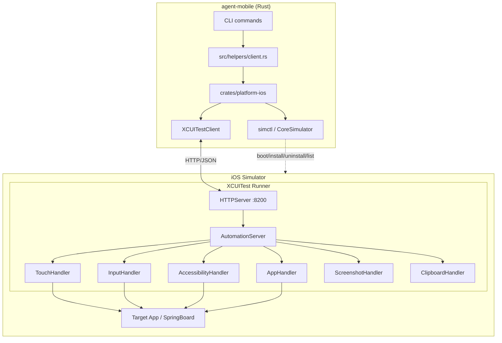
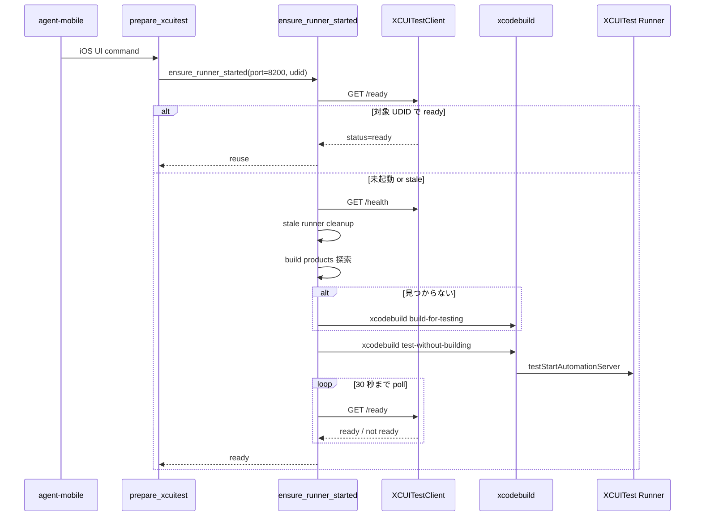
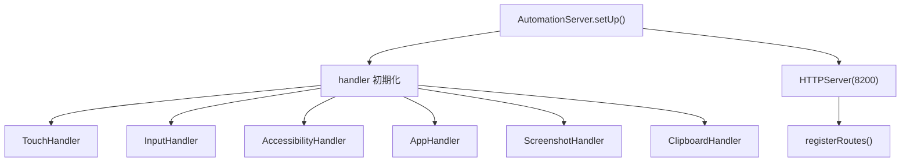
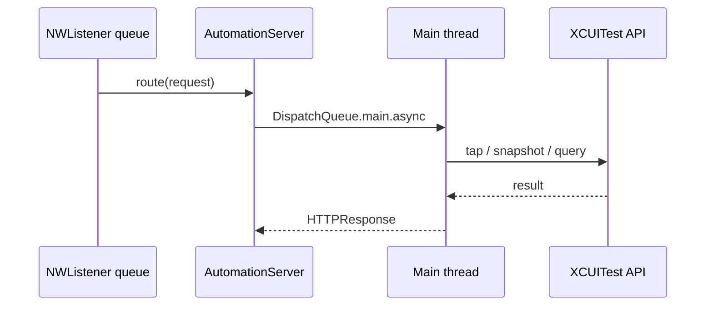

# iOS Runner ガイド

`agent-mobile` の iOS 自動化は、`simctl` だけでは完結しません。インストールや Simulator の起動は host 側のコマンドで処理し、UI のタップ、文字入力、スナップショット取得は Simulator 内で動く XCUITest Runner が担当します。

このドキュメントは、現在の `agent-mobile` が iOS で何をどう実行しているかを、セットアップ、起動シーケンス、HTTP API、運用上の制約まで含めて 0 ベースで説明するためのものです。

## 1. まず全体像



### 役割分担

| レイヤ | 役割 | 主な実装 |
| --- | --- | --- |
| CLI | コマンド解釈、UDID 解決、出力整形 | `src/` |
| helper | Runner 起動保証、app context 復元 | `src/helpers/client.rs` |
| `platform-ios` | Runner 管理、HTTP client、`simctl`/CoreSimulator 呼び出し | `crates/platform-ios/src/xcuitest/*.rs` |
| XCUITest Runner | Simulator 内で XCUITest API を実行 | `crates/xcuitest-runner/XCUITestRunnerUITests/*.swift` |
| `simctl` / CoreSimulator | 端末管理、アプリ install/uninstall、host 側 launch/terminate | `xcrun simctl`, `coresim` wrapper |

## 2. 何が Runner 経由で、何が `simctl` 経由か

`agent-mobile` の iOS 実装は hybrid 構成です。

| 操作 | 経路 | 理由 |
| --- | --- | --- |
| `tap`, `long-press`, `swipe`, `type`, `fill`, `scroll` | XCUITest Runner | 実 UI を XCUITest API で触る必要がある |
| `snapshot`, `find`, `wait`, `get`, `is` | XCUITest Runner | アクセシビリティ情報と座標が必要 |
| `screenshot` | XCUITest Runner | 現在の前面 UI をそのまま PNG で取る |
| `device pbcopy`, `device pbpaste` | XCUITest Runner | Simulator 内 clipboard にアクセスする |
| `device list`, `device boot`, `device shutdown` | `simctl` / CoreSimulator | 端末ライフサイクル操作 |
| `app install`, `app uninstall`, `app list` | `simctl` | UI テスト不要 |
| `app launch`, `app terminate` | CoreSimulator + Runner context 同期 | 起動自体は host 側が速く、以後の UI 操作のため Runner 側 context も合わせる |

重要なのは、iOS の UI 自動化は「Runner を起動していれば全部そこ経由」ではないことです。UI 操作と端末管理を分離しているので、障害切り分けの起点もここになります。

## 3. Runner の起動シーケンス

CLI から iOS 向けの UI 操作が呼ばれると、まず `prepare_xcuitest_*()` が `ensure_runner_started()` を通して Runner の準備を保証します。



### 起動時の実装ポイント

- ポートは `8200` 固定です。
- `RunnerBuildProducts::find()` は次の順で `.app` を探します。
  1. 現在の実行バイナリの隣
  2. `~/Library/Developer/Xcode/DerivedData/XCUITestRunner-*/Build/Products/Debug-iphonesimulator`
  3. カレントディレクトリ配下の `build/Build/Products/Debug-iphonesimulator`
- build product がなければ `xcodebuild build-for-testing` を実行します。
- 起動は `xcodebuild test-without-building` で `XCUITestRunnerUITests/AutomationServer/testStartAutomationServer` だけを実行します。
- `/ready` が通らず失敗した場合は 1 回だけ clean up して再試行します。
- 起動ログは一時ディレクトリに `agent-mobile-xcuitest-runner-<UDID>.log` として保存されます。

## 4. `/health` と `/ready` の違い

この区別はかなり重要です。

| エンドポイント | 何を保証するか | 用途 |
| --- | --- | --- |
| `/health` | HTTP サーバーが応答する | stale runner の検出 |
| `/ready` | XCUITest API が main thread で実行可能 | 実運用上の可用性判定 |

`/ready` は `AccessibilityHandler.isReady()` を main queue 上で呼びます。つまり「HTTP は生きているが UI 操作だけ死んでいる」状態を弾けます。Runner を再利用してよいかの最終判定は必ず `/ready` で行います。

## 5. app context の扱い

Runner は単に起動しているだけでは不十分で、どのアプリを現在の `XCUIApplication` として見ているかが重要です。

### 5.1 初期状態

- `AutomationServer.setUp()` 直後の context は SpringBoard です。
- ただし起動時に SpringBoard を前面化はしません。
- これは Runner 起動のたびに Home へ跳ぶ副作用を避けるためです。

### 5.2 context 切り替え

`switchContext(to:)` が以下をまとめて更新します。

- `app`
- `activeBundleId`
- `AccessibilityHandler`
- `TouchHandler`
- `InputHandler`

### 5.3 永続化された app context

CLI 側は最後に起動した iOS アプリを `/tmp/agent-mobile/app-context/<UDID>.json` に保存します。

- `app launch` は host 側でアプリを起動したあと `set_active_app()` で保存し、Runner にも `set_app()` を送ります。
- `app terminate` は host 側で終了し、保存済み context を消します。
- `tap` や `snapshot` のような後続コマンドは `AppContextPolicy::RestoreIfUnset` を使い、Runner 側に active app が無いときだけ保存済み bundle ID を復元します。

この仕組みによって、Runner の再起動後でも直前に触っていたアプリへ自動で戻せます。

## 6. Runner の内部構造



### スレッドモデル

`HTTPServer` は `NWListener` を使ってバックグラウンドキューでリクエストを受けます。一方で XCUITest API は main thread 実行が前提です。そのため各 route handler は `onMain { ... }` を通して UI 操作を dispatch します。



実装上の注意:

- `DispatchQueue.main.sync` は使いません。デッドロックの原因になります。
- `/ready` も同じ経路を通します。readiness だけ特別扱いはしていません。

## 7. 最新の HTTP API

この API は `agent-mobile` 内部用です。外部公開 API としての安定性は前提にしていません。

### 7.1 状態確認

| Endpoint | Method | 概要 |
| --- | --- | --- |
| `/health` | GET | HTTP サーバーの生存確認 |
| `/ready` | GET | XCUITest API の実行可否を含む readiness 確認 |

どちらも `status`, `runner`, `udid`, `active_bundle_id`, `snapshot_generation` を返し得ます。

### 7.2 画面参照と検索

| Endpoint | Method | 概要 |
| --- | --- | --- |
| `/snapshot` | GET | 高速なフラット snapshot を返す |
| `/query/first` | POST | 条件に一致する最初の要素を返す |
| `/query/exists` | POST | 条件一致の有無だけ返す |
| `/ui-hash` | GET | 現在 UI の軽量ハッシュを返す |
| `/accessibility` | GET | 旧来の再帰アクセシビリティ tree を返す |
| `/screenshot` | GET | PNG バイト列を返す |

#### `/snapshot`

クエリ:

- `depth`
- `interactive_only`
- `compact`
- `visible_only`
- `max_nodes`

レスポンス:

- `snapshot_id`
- `active_bundle_id`
- `snapshot_generation`
- `elements[]`

各 element は少なくとも次を持ちます。

- `element_id`
- `type`
- `label`
- `value`
- `placeholder`
- `frame`
- `enabled`
- `interactive`
- `depth`

`snapshot` は、現在の CLI で `snapshot`, `tap @eN`, `find`, `wait`, `get`, `is` の高速経路に使われる中心 API です。

#### `/query/first` と `/query/exists`

POST body:

```json
{
  "locator": "text",
  "value": "Login",
  "exact": false,
  "caseSensitive": false,
  "visibleOnly": true,
  "maxDepth": 3
}
```

`locator` は次を受け付けます。

- `text`
- `label`
- `placeholder`
- `type`
- `element_id`

`maxDepth` が無い場合は、`AccessibilityHandler.fastQueryFirst()` が優先されます。これは snapshot 全件生成より軽い検索経路です。

#### `/ui-hash`

クエリ:

- `source=screenshot|accessibility`
- `visible_only`
- `depth`

用途は「UI が変化したか」の軽量判定です。`source=screenshot` がデフォルトです。

#### `/accessibility`

クエリ:

- `nested=true|false`
- `depth`

これは互換性維持とデバッグ用の古い tree API です。通常の CLI の高速処理は `/snapshot` と `/query/*` を優先します。

### 7.3 UI 操作

| Endpoint | Method | body |
| --- | --- | --- |
| `/tap` | POST | `{"x":100,"y":200}` |
| `/longpress` | POST | `{"x":100,"y":200,"duration":1.5}` |
| `/swipe` | POST | `{"startX":100,"startY":500,"endX":100,"endY":100,"duration":0.3}` |
| `/type` | POST | `{"text":"hello"}` |
| `/keypress` | POST | `{"key":"enter"}` |
| `/clear-text` | POST | `{}` |
| `/button` | POST | `{"button":"home"}` |

補足:

- 座標操作は SpringBoard の coordinate space を基準にした absolute coordinate です。
- `type` はフォーカス済み要素、または first responder へ入力します。
- `clear-text` は Command+A のあと delete を送ります。
- `keypress` は `enter`, `tab`, `delete`, `escape`, `space`, 矢印キー、単一文字を扱えます。
- `button` は現在の実装では `home` だけが実質サポート対象です。`volume_up` と `volume_down` は iOS Simulator では使えないため成功しません。

### 7.4 アプリと clipboard

| Endpoint | Method | 概要 |
| --- | --- | --- |
| `/launch` | POST | 指定 bundle ID のアプリを起動し context を切り替える |
| `/terminate` | POST | 指定 bundle ID のアプリを終了し SpringBoard context に戻す |
| `/set-app` | POST | 起動せず context だけ切り替える |
| `/clipboard/copy` | POST | clipboard へ書き込む |
| `/clipboard/paste` | GET | clipboard の内容を読む |
| `/clipboard/clear` | POST | clipboard を消す |

`/launch` と `/terminate` も実装上は存在しますが、CLI の `app launch` と `app terminate` は host 側の CoreSimulator 呼び出しを使ったうえで、必要な context 同期だけ Runner に行います。

## 8. `snapshot_generation` が何に使われるか

Runner は UI に影響する操作のたびに `snapshotGeneration` を増やします。

増加対象:

- `tap`
- `longpress`
- `swipe`
- `type`
- `keypress`
- `clear-text`
- `button`
- `launch`
- `terminate`
- `set-app`

この値は `ready`, `snapshot`, `query`, `ui-hash` に含まれ、CLI 側で「同じ UI を見ているか」を判断する材料になります。

## 9. 現在の制約

- iOS Runner は 1 ポート固定です。複数 Simulator を同時に 1 プロセスで扱う設計ではありません。
- 対象 UDID は boot 済み Simulator である必要があります。
- stale runner が別 UDID に紐づいていたら停止して切り替えます。
- screenshot は host 側 `simctl io screenshot` ではなく Runner から取得します。
- 座標系は absolute coordinate 前提なので、表示スケールではなく実画面座標で考える必要があります。
- `find` や `tap @eN` は snapshot cache と `element_id` を使った再解決に依存します。古い ref は無効化されます。

## 10. 障害時の見方

| 症状 | まず見る場所 |
| --- | --- |
| Runner が起動しない | 一時ログ `agent-mobile-xcuitest-runner-<UDID>.log` |
| HTTP は通るのに UI 操作だけ失敗する | `/health` ではなく `/ready` の結果 |
| 別 Simulator に繋がっている | `ready.udid` と対象 UDID の一致 |
| `tap @eN` が失敗する | snapshot cache が古くないか、`agent-mobile snapshot` を取り直す |
| 画面検索が重い | `/accessibility` ではなく `/snapshot` / `/query/*` を使う経路か |
| アプリ install/uninstall が失敗する | Runner ではなく `simctl` 経路の問題か確認 |

## 11. 重要ファイル

| ファイル | 内容 |
| --- | --- |
| `src/helpers/client.rs` | Runner 起動保証と app context 復元 |
| `src/session/app_context.rs` | iOS app context の永続化 |
| `crates/platform-ios/src/xcuitest/client.rs` | Rust 側 HTTP client |
| `crates/platform-ios/src/xcuitest/runner.rs` | build product 探索、起動、retry、cleanup |
| `crates/platform-ios/src/xcuitest/types.rs` | Runner API の serde 型 |
| `crates/xcuitest-runner/XCUITestRunnerUITests/AutomationServer.swift` | route 登録、status、context 切り替え |
| `crates/xcuitest-runner/XCUITestRunnerUITests/HTTPServer.swift` | `NWListener` ベース HTTP サーバー |
| `crates/xcuitest-runner/XCUITestRunnerUITests/AccessibilityHandler.swift` | snapshot/query/accessibility の中心実装 |
| `crates/xcuitest-runner/XCUITestRunnerUITests/TouchHandler.swift` | tap / swipe / button |
| `crates/xcuitest-runner/XCUITestRunnerUITests/InputHandler.swift` | type / keypress / clear-text |

## 12. 要点だけまとめると

`agent-mobile` の iOS 自動化は、UI 制御を XCUITest Runner、端末管理を `simctl` / CoreSimulator に分離しています。Runner の可用性判定は `/health` ではなく `/ready` が基準で、現在の CLI は旧来の `/accessibility` よりも `/snapshot`、`/query/first`、`/query/exists`、`/ui-hash` を中心に動きます。

拡張や不具合調査では、まず次の順で見るのが最短です。

1. そのコマンドは Runner 経由か `simctl` 経由か。
2. Runner は対象 UDID で `/ready` になっているか。
3. active app context と snapshot cache が期待通りか。
