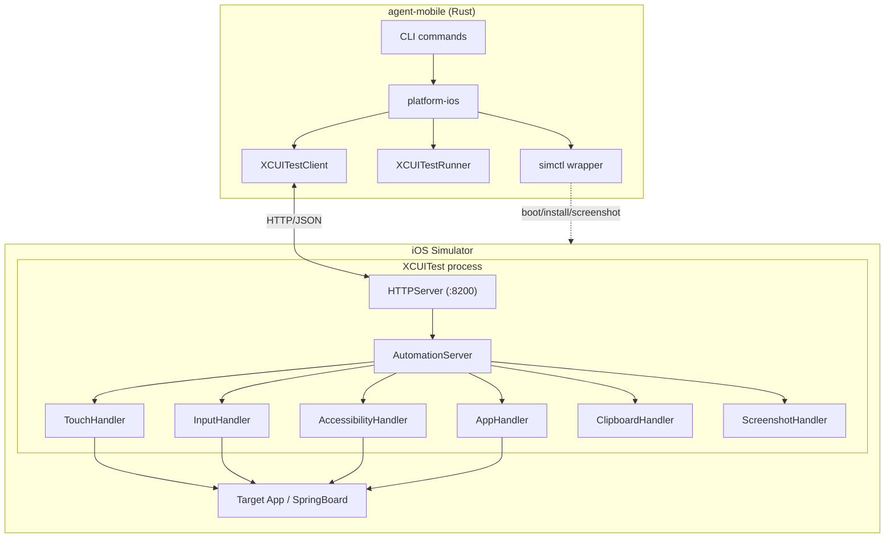
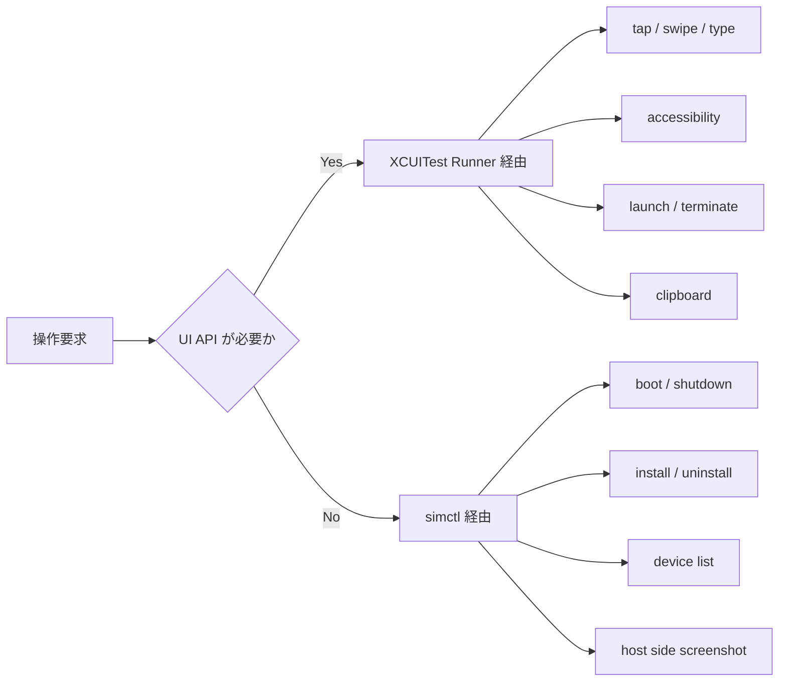
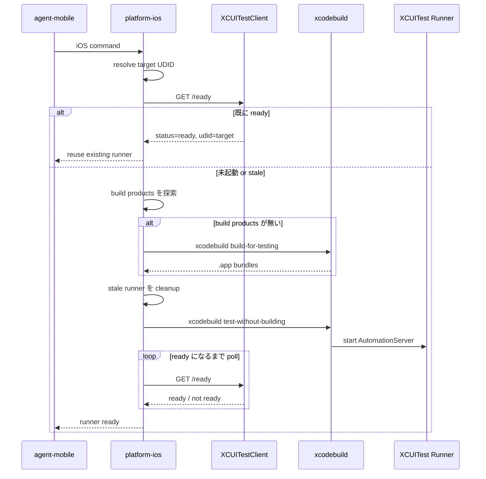
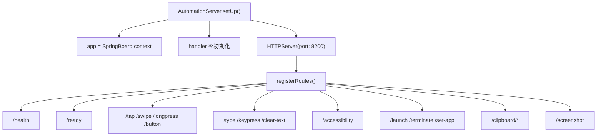
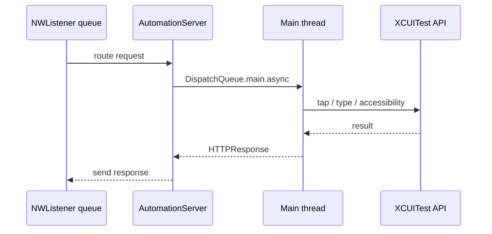
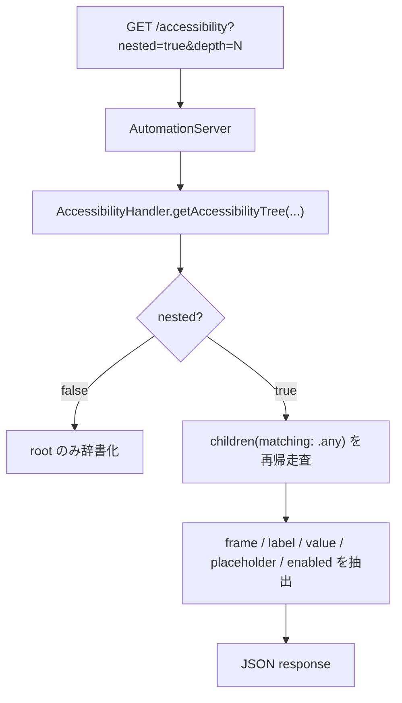
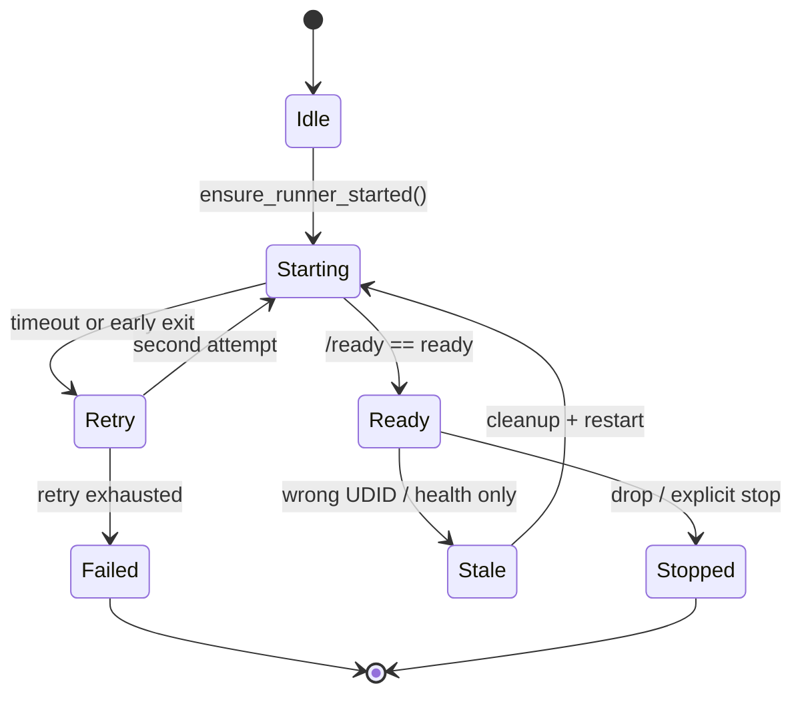

# iOS Runner ドキュメント

`agent-mobile` の iOS 自動化は、`xcrun simctl` だけでは完結しません。画面タップ、キーボード入力、アクセシビリティツリー取得のような UI 操作は、`crates/xcuitest-runner` にある XCUITest Runner が担当します。

このドキュメントは、iOS runner の役割、起動シーケンス、HTTP API、設計上の制約を 1 本にまとめたものです。

## 全体像

### 役割分担

| レイヤ | 役割 | 主なファイル |
| --- | --- | --- |
| Rust CLI | コマンド受付、セッション解決、出力整形 | `src/`, `src/helpers/client.rs` |
| `platform-ios` | runner 起動、HTTP クライアント、simctl ラッパー | `crates/platform-ios/src/xcuitest/*.rs`, `crates/platform-ios/src/simctl/*.rs` |
| XCUITest Runner | Simulator 内で HTTP を受けて XCUITest API を実行 | `crates/xcuitest-runner/XCUITestRunnerUITests/*.swift` |
| `simctl` | Simulator の boot/install/uninstall/screenshot など | `xcrun simctl` |

## なぜ hybrid 構成なのか

- XCUITest API が必要な操作は、Simulator 内部で動く UI テストプロセスからしか安全に呼べません。
- 一方で、Simulator 自体のライフサイクル操作は `simctl` のほうが適切です。
- そのため iOS 実装は「UI 制御は runner」「端末管理は simctl」という 2 経路構成になっています。

## 起動シーケンス

`platform-ios` は、対象 Simulator に対して runner が起動済みかを確認し、必要なら `xcodebuild test-without-building` で立ち上げます。

### 起動時の実装ポイント

- ポートは `8200` 固定です。
- readiness 判定は `/health` ではなく `/ready` を使います。
- `/ready` は軽量な XCUITest API 呼び出しを含むため、「HTTP サーバーは生きているが UI 操作は死んでいる」状態を検知できます。
- 既存 runner が別 UDID に紐づいている場合は、再利用せず cleanup してから再起動します。
- 起動失敗時のログは一時ディレクトリに `agent-mobile-xcuitest-runner-<UDID>.log` として保存されます。

## サーバー内部構造

### `AutomationServer` の要点

- `XCTestCase` ベースの長寿命テストとして動作します。
- `testStartAutomationServer()` で HTTP サーバーを起動し、長い `expectation` でプロセスを維持します。
- 初期コンテキストは SpringBoard です。これにより特定アプリ未起動でも座標系を安定化できます。
- `switchContext(to:)` で対象 bundle ID に切り替えると、`XCUIApplication` と各 handler をまとめて差し替えます。

## スレッドモデル

XCUITest API はメインスレッドで実行する必要があります。HTTP 受信自体は `NWListener` のバックグラウンドキューで処理されるため、handler 実行前にメインキューへ移します。

### この制約が重要な理由

- `XCUICoordinate.tap()` や `XCUIApplication.typeText()` はメインスレッド実行が前提です。
- `DispatchQueue.main.sync` を使うとデッドロックの原因になるため、実装は `DispatchQueue.main.async` を採用しています。
- `/ready` もメインキュー経由で `AccessibilityHandler.isReady()` を呼び、実際に UI API が応答可能かを確認します。

## 主要エンドポイント

| Endpoint | Method | 用途 | 実装先 |
| --- | --- | --- | --- |
| `/health` | GET | HTTP サーバー存活確認 | `AutomationServer.swift` |
| `/ready` | GET | XCUITest API まで含めた readiness 確認 | `AutomationServer.swift` |
| `/tap` | POST | 座標タップ | `TouchHandler.swift` |
| `/longpress` | POST | ロングプレス | `TouchHandler.swift` |
| `/swipe` | POST | スワイプ | `TouchHandler.swift` |
| `/button` | POST | ハードウェアボタン | `TouchHandler.swift` |
| `/type` | POST | テキスト入力 | `InputHandler.swift` |
| `/keypress` | POST | 特殊キー入力 | `InputHandler.swift` |
| `/clear-text` | POST | 全選択 + 削除 | `InputHandler.swift` |
| `/accessibility` | GET | アクセシビリティツリー取得 | `AccessibilityHandler.swift` |
| `/launch` | POST | アプリ起動 + context 切替 | `AppHandler.swift` |
| `/terminate` | POST | アプリ終了 + SpringBoard に戻す | `AppHandler.swift` |
| `/set-app` | POST | 起動せず context のみ切替 | `AutomationServer.swift` |
| `/screenshot` | GET | runner 内部の PNG 取得 | `ScreenshotHandler.swift` |
| `/clipboard/copy` | POST | クリップボード書き込み | `ClipboardHandler.swift` |
| `/clipboard/paste` | GET | クリップボード読み取り | `ClipboardHandler.swift` |
| `/clipboard/clear` | POST | クリップボード消去 | `ClipboardHandler.swift` |

### 注意が必要な API

- `/install`
- `/uninstall`
- `/list-apps`

これらの route は存在しますが、runner 内では実行できず `501` を返します。iOS 上では `Process` を使えないため、実際の install/uninstall/listapps は host 側の `simctl` を使う前提です。

## アクセシビリティ取得の流れ

### 取得データの特徴

- `type`
- `AXLabel`
- `AXValue`
- `AXPlaceholderValue`
- `frame`
- `enabled`
- `children` (`nested=true` の場合)

`frame` は `NaN` や `infinite` を `0` に正規化して JSON 化します。これは serialization crash 回避のためです。

## 入力と座標操作の設計

### 座標操作

- `TouchHandler` は対象アプリではなく SpringBoard 座標系を基準に absolute coordinate を解釈します。
- これにより、前面アプリが切り替わっても screen coordinate の安定性を維持しやすくなっています。

### テキスト入力

- `InputHandler.typeText()` は `app.typeText(text)` を使い、フォーカス済み要素や first responder に入力します。
- `clearText()` は Command+A の後に delete を送ります。
- `keypress` は `enter`, `tab`, `delete`, `escape`, 矢印キーなどを `XCUIElement.typeKey()` または `typeText()` にマップします。

## Runner のライフサイクル管理

### cleanup の内容

- `coresim::terminate_app()` で host app と `xctrunner` を終了
- `pkill` / `pgrep` による `xcodebuild test-without-building` プロセス掃除
- stale runner が別 Simulator にぶら下がっている場合も停止

## 障害時に見る場所

| 症状 | 確認ポイント |
| --- | --- |
| `/ready` が通らない | 一時ログ `agent-mobile-xcuitest-runner-<UDID>.log` |
| runner が別 Simulator に接続される | `health.udid` と対象 UDID の不一致 |
| UI 操作だけ固まる | `/health` ではなく `/ready` の結果を見る |
| install/uninstall が失敗する | runner ではなく `simctl` 経由になっているか確認 |
| 座標タップがずれる | SpringBoard 基準の absolute coordinate を前提にしているか確認 |

## 主要ファイル

| ファイル | 内容 |
| --- | --- |
| `crates/platform-ios/src/xcuitest/client.rs` | Rust 側 HTTP クライアント |
| `crates/platform-ios/src/xcuitest/runner.rs` | runner 起動、ready 判定、cleanup |
| `crates/xcuitest-runner/XCUITestRunnerUITests/AutomationServer.swift` | route 登録と context 切替 |
| `crates/xcuitest-runner/XCUITestRunnerUITests/HTTPServer.swift` | `NWListener` ベース HTTP サーバー |
| `crates/xcuitest-runner/XCUITestRunnerUITests/TouchHandler.swift` | tap / swipe / button |
| `crates/xcuitest-runner/XCUITestRunnerUITests/InputHandler.swift` | type / keypress / clear-text |
| `crates/xcuitest-runner/XCUITestRunnerUITests/AccessibilityHandler.swift` | accessibility tree 抽出 |
| `crates/xcuitest-runner/XCUITestRunnerUITests/AppHandler.swift` | launch / terminate と 501 応答 |

## まとめ

iOS runner は、`agent-mobile` が iOS Simulator を UI レベルで操作するための中核です。設計の要点は次の 3 つです。

1. UI 操作は XCUITest Runner、端末管理は `simctl` に分離する。
2. XCUITest API は必ずメインスレッドへ dispatch する。
3. runner の利用可否は `/health` ではなく `/ready` で判定する。

この 3 点を押さえると、iOS まわりの不具合切り分けと拡張方針がかなり追いやすくなります。
