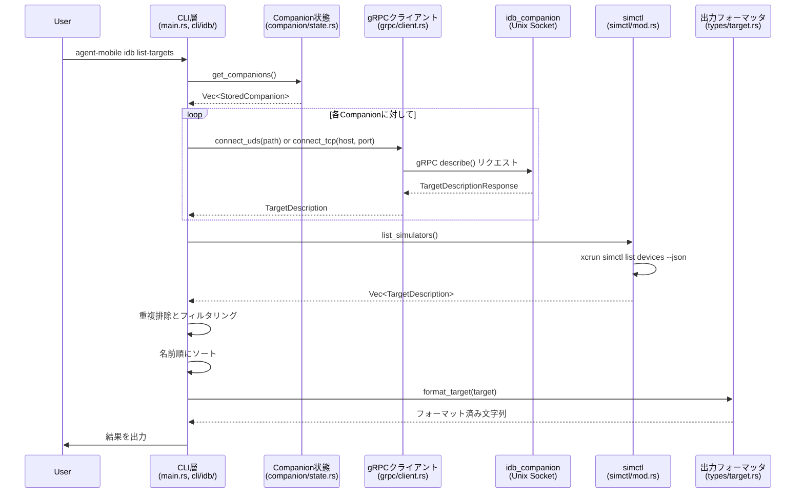
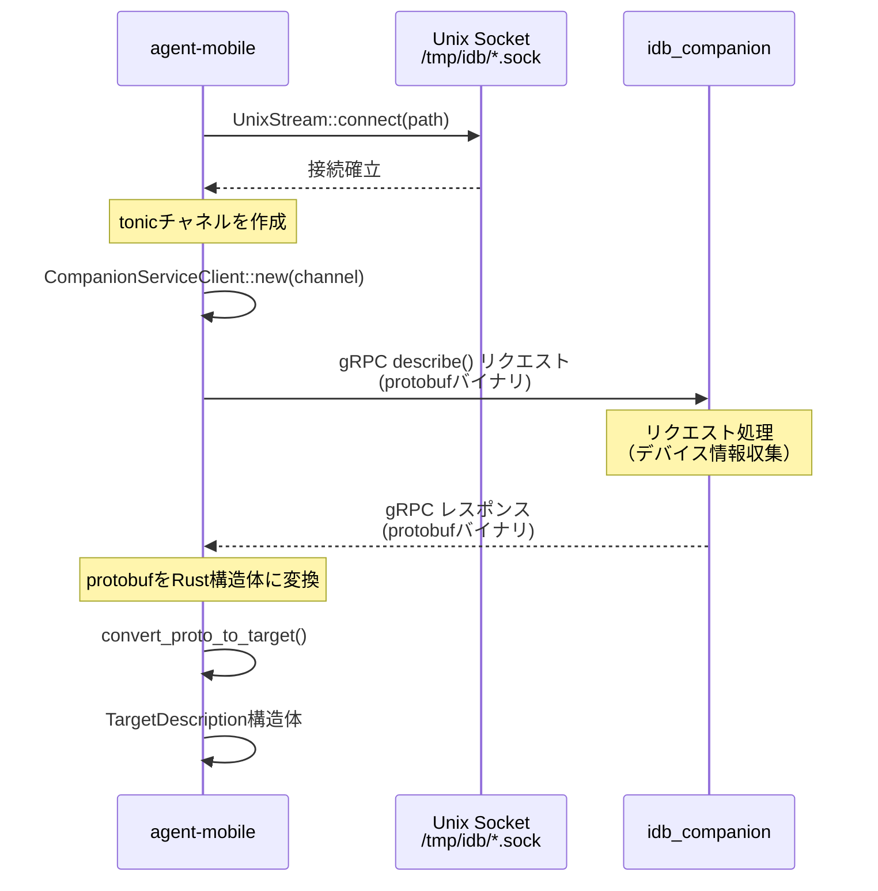

# agent-mobile idb list-targets ドキュメント

## 目次

1. [イントロダクション](#イントロダクション)
2. [アーキテクチャ概要](#アーキテクチャ概要)
3. [主要コンポーネント](#主要コンポーネント)
4. [データフロー](#データフロー)
5. [gRPC通信の仕組み](#grpc通信の仕組み)
6. [出力フォーマット](#出力フォーマット)
7. [テスト戦略](#テスト戦略)

---

## イントロダクション

### 機能概要

`agent-mobile idb list-targets` は、Python版idbの `list-targets` コマンドと同等の機能をRustで実装したCLIツールです。iOS デバイス（物理デバイスおよびシミュレータ）の一覧を取得し、JSONまたは人間が読みやすい形式で出力します。

### Python idbとの互換性

このRust実装は、Python版idbと以下の点で互換性があります：

- 同じ出力形式をサポート（JSON/Human-readable）
- 同じフィルタオプション（`--only device|simulator|mac`）
- 同じターゲット情報（UDID、名前、状態、OSバージョンなど）

### 使用例

```bash
# JSON形式で全てのターゲットを表示（デフォルト）
$ agent-mobile idb list-targets

# 人間が読みやすい形式で表示（idbコマンドと同じ出力）
$ agent-mobile idb list-targets --human

# シミュレータのみをフィルタ
$ agent-mobile idb list-targets --only simulator

# デバイスのみをフィルタ（人間が読みやすい形式）
$ agent-mobile idb list-targets --only device --human
```

#### 出力例

**JSON形式（デフォルト）:**
```json
{"udid":"00008030-001A5D223A83802E","name":"iPhone 13 Pro","state":"Booted","type":"device","os_version":"iOS 15.0","architecture":"arm64","companion_info":{"udid":"00008030-001A5D223A83802E","is_local":true,"address":"127.0.0.1:10882"}}
{"udid":"8B4F4E9A-2C2A-4E8E-9B1A-5D4E3C2A1B0C","name":"iPhone 14 Pro","state":"Shutdown","type":"simulator","os_version":"iOS 16.0","architecture":"arm64","companion_info":null}
```

**Human-readable形式（--human オプション）:**
```
00008030-001A5D223A83802E | iPhone 13 Pro | Booted | device | iOS 15.0 | arm64 | 127.0.0.1:10882
8B4F4E9A-2C2A-4E8E-9B1A-5D4E3C2A1B0C | iPhone 14 Pro | Shutdown | simulator | iOS 16.0 | arm64
```

---

## アーキテクチャ概要

### コマンド実行フロー

以下のシーケンス図は、ユーザーがコマンドを実行してから結果が表示されるまでの流れを示しています。



### 主要な型定義

```mermaid
classDiagram
    class TargetDescription {
        +String udid
        +String name
        +String state
        +TargetType target_type
        +String os_version
        +String architecture
        +Option~CompanionInfo~ companion_info
    }

    class TargetType {
        <<enumeration>>
        Device
        Simulator
        Mac
    }

    class CompanionInfo {
        +String udid
        +bool is_local
        +Address address
    }

    class Address {
        <<enumeration>>
        Tcp { host: String, port: u16 }
        DomainSocket { path: String }
    }

    class StoredCompanion {
        +String udid
        +bool is_local
        +Option~u32~ pid
        +Option~String~ host
        +Option~u16~ port
        +Option~String~ path
        +address() Option~Address~
    }

    TargetDescription --> TargetType
    TargetDescription --> CompanionInfo
    CompanionInfo --> Address
    StoredCompanion --> Address
```

### ディレクトリ構造

| パス | 説明 |
|------|------|
| `src/main.rs` | エントリーポイント。CLIパーサーを初期化し、コマンドをディスパッチ |
| `src/cli/idb/mod.rs` | CLIコマンド定義（clap derive使用） |
| `src/cli/idb/list_targets.rs` | list-targetsコマンドの実装ロジック |
| `src/grpc/mod.rs` | gRPCクライアントのモジュール定義 |
| `src/grpc/client.rs` | gRPCクライアント実装（tonic使用） |
| `src/types/mod.rs` | 型定義のモジュール |
| `src/types/target.rs` | ターゲット関連の型とフォーマッタ |
| `src/companion/mod.rs` | Companion状態管理のモジュール |
| `src/companion/state.rs` | Companion状態ファイルの読み取り |
| `src/simctl/mod.rs` | simctl統合（xcrunコマンド実行） |
| `proto/idb.proto` | gRPC service定義（Protocol Buffers） |
| `build.rs` | ビルド時にprotoファイルをコンパイル |
| `tests/list_targets_integration.rs` | 統合テスト（idbとの出力比較） |

---

## 主要コンポーネント

### 1. CLI層 (`src/cli/`)

CLIの引数解析とコマンド定義を担当します。[clap](https://docs.rs/clap/)クレートの`derive`マクロを使用して、宣言的にCLIを定義しています。

#### src/cli/idb/mod.rs

```rust
use clap::Subcommand;

#[derive(Subcommand, Debug)]
pub enum IdbCommands {
    /// List available targets
    #[command(name = "list-targets")]
    ListTargets {
        /// Only show specific target type (device, simulator, mac)
        #[arg(long)]
        only: Option<String>,

        /// Output in human-readable format (like idb)
        #[arg(long)]
        human: bool,
    },
}
```

**ポイント:**
- `#[derive(Subcommand)]`: clapのサブコマンド機能を自動生成
- `#[arg(long)]`: `--only` や `--human` のような長いオプション名を定義
- `Option<String>`: オプショナルな引数（指定されない場合は `None`）
- `bool`: フラグ型の引数（指定されると `true`）

#### src/cli/idb/list_targets.rs

このファイルには、実際の`list-targets`コマンドの実行ロジックが含まれています。

**主な処理フロー:**

| ステップ | 処理内容 | ファイル参照 |
|---------|---------|-------------|
| 1. フィルタ解析 | `--only` オプションをパース | line 9-12 |
| 2. Companion取得 | 状態ファイルから保存済みCompanionを読み込み | line 18-19 |
| 3. gRPC接続 | 各CompanionにgRPCで接続してターゲット情報を取得 | line 21-41 |
| 4. Simctl取得 | `xcrun simctl` を実行してローカルシミュレータを取得 | line 43-59 |
| 5. 重複排除 | CompanionとSimctlで重複するUDIDを除外 | line 52-55 |
| 6. フィルタリング | `--only` オプションに基づいてフィルタ | line 61-64 |
| 7. ソート | 名前順にソート（Python idbと同じ動作） | line 67 |
| 8. フォーマット | JSON or Human-readableに変換 | line 70-78 |

### 2. gRPCクライアント (`src/grpc/`)

idb_companionとの通信を担当します。[tonic](https://docs.rs/tonic/)クレートを使用してgRPCクライアントを実装しています。

#### gRPCとは？（初心者向け解説）

**gRPC (gRPC Remote Procedure Call)** は、Googleが開発したRPC（リモートプロシージャコール）フレームワークです。

- **従来のREST API**: HTTPリクエストを送り、JSONレスポンスを受け取る
- **gRPC**: まるでローカル関数を呼ぶようにリモートサーバーの関数を呼べる

**gRPCの特徴:**
- Protocol Buffers（protobuf）でデータをシリアライズ（JSONより高速・コンパクト）
- HTTP/2を使用（双方向ストリーミング、マルチプレキシング対応）
- 型安全（protoファイルから自動生成されるコードで型チェック）

#### src/grpc/client.rs の実装

```rust
use tonic::transport::{Channel, Endpoint};
use tokio::net::UnixStream;

pub struct IdbClient {
    client: CompanionServiceClient<Channel>,
}

impl IdbClient {
    /// Unix Domain Socketで接続
    pub async fn connect_uds(socket_path: &str) -> Result<Self, Box<dyn std::error::Error>> {
        // Unix Socketへの接続をカスタムコネクタとして実装
        let channel = Endpoint::try_from("http://[::]:50051")?
            .connect_with_connector(service_fn(move |_: Uri| {
                let path = socket_path_owned.clone();
                async move {
                    let stream = UnixStream::connect(path).await?;
                    Ok::<_, std::io::Error>(TokioIo::new(stream))
                }
            }))
            .await?;

        let client = CompanionServiceClient::new(channel);
        Ok(Self { client })
    }

    /// ターゲット情報を取得
    pub async fn describe(&mut self, fetch_diagnostics: bool)
        -> Result<TargetDescription, Box<dyn std::error::Error>>
    {
        let request = tonic::Request::new(TargetDescriptionRequest {
            fetch_diagnostics,
            ..Default::default()
        });

        let response = self.client.describe(request).await?;
        let proto_target = response.into_inner().target_description.unwrap();

        // protoメッセージを自前のTargetDescription型に変換
        Ok(convert_proto_to_target(proto_target))
    }
}
```

**ポイント:**
- `async/await`: 非同期処理（I/O待ちの間に他の処理を実行可能）
- `UnixStream::connect()`: Unix Domain Socketへの接続
- `CompanionServiceClient`: protoファイルから自動生成されたクライアント型
- `tonic::Request::new()`: gRPCリクエストの作成

### 3. simctl統合 (`src/simctl/`)

Appleの`xcrun simctl`コマンドを実行して、ローカルマシン上のシミュレータ一覧を取得します。

#### src/simctl/mod.rs

```rust
use std::process::Command;

pub fn list_simulators() -> Result<Vec<TargetDescription>, Box<dyn std::error::Error>> {
    // xcrun simctl list devices --json を実行
    let output = Command::new("xcrun")
        .args(["simctl", "list", "devices", "--json"])
        .output()?;

    if !output.status.success() {
        return Err("simctl command failed".into());
    }

    // JSONをパース
    let simctl_output: SimctlOutput = serde_json::from_slice(&output.stdout)?;

    let mut targets = Vec::new();

    // 各iOS/tvOS/watchOSランタイムを走査
    for (runtime_name, devices) in simctl_output.devices {
        for device in devices {
            // ... デバイス情報をTargetDescriptionに変換 ...
            targets.push(target);
        }
    }

    Ok(targets)
}
```

**処理の流れ:**

1. `Command::new("xcrun")` - xcrunコマンドを実行
2. `.args(["simctl", "list", "devices", "--json"])` - 引数を追加
3. `.output()?` - コマンドを実行して出力を取得
4. `serde_json::from_slice()` - JSON出力をRust構造体にデシリアライズ
5. デバイス情報を`TargetDescription`に変換

**simctlの出力例:**
```json
{
  "devices": {
    "com.apple.CoreSimulator.SimRuntime.iOS-16-0": [
      {
        "udid": "8B4F4E9A-2C2A-4E8E-9B1A-5D4E3C2A1B0C",
        "name": "iPhone 14 Pro",
        "state": "Shutdown",
        "isAvailable": true
      }
    ]
  }
}
```

### 4. 型定義 (`src/types/`)

アプリケーション全体で使用される共通の型定義です。

#### src/types/target.rs の主要な型

**TargetDescription:**
```rust
#[derive(Debug, Clone, Serialize, Deserialize)]
pub struct TargetDescription {
    pub udid: String,           // デバイスの一意識別子
    pub name: String,           // デバイス名（例: "iPhone 14 Pro"）
    pub state: String,          // 状態（例: "Booted", "Shutdown"）
    pub target_type: TargetType, // デバイス種別
    pub os_version: String,     // OSバージョン（例: "iOS 16.0"）
    pub architecture: String,   // アーキテクチャ（例: "arm64"）
    pub companion_info: Option<CompanionInfo>, // Companion接続情報
}
```

**TargetType:**
```rust
#[derive(Debug, Clone, PartialEq, Serialize, Deserialize)]
#[serde(rename_all = "lowercase")]
pub enum TargetType {
    Device,      // 物理デバイス
    Simulator,   // シミュレータ
    Mac,         // Macデバイス（Mac Catalyst対応）
}
```

**Address:**
```rust
#[derive(Debug, Clone, PartialEq, Serialize, Deserialize)]
#[serde(tag = "type", rename_all = "snake_case")]
pub enum Address {
    Tcp { host: String, port: u16 },
    DomainSocket { path: String },
}
```

#### フォーマッタ関数

**JSON形式:**
```rust
pub fn json_format_target(target: &TargetDescription) -> String {
    serde_json::to_string(target).unwrap()
}
```

**Human-readable形式:**
```rust
pub fn human_format_target(target: &TargetDescription) -> String {
    let address_str = match &target.companion_info {
        Some(info) => format!(" | {}", info.address),
        None => String::new(),
    };

    format!(
        "{} | {} | {} | {} | {} | {}{}",
        target.udid,
        target.name,
        target.state,
        target.target_type,
        target.os_version,
        target.architecture,
        address_str
    )
}
```

### 5. Companion状態管理 (`src/companion/`)

idb_companionの接続情報を管理します。idb_companionは起動時に状態ファイル（デフォルト: `/tmp/idb/state`）に接続情報を書き込みます。

#### src/companion/state.rs

```rust
const IDB_STATE_FILE_PATH: &str = "/tmp/idb/state";

pub struct CompanionState {
    state_file_path: String,
}

impl CompanionState {
    pub fn get_companions(&self) -> Vec<StoredCompanion> {
        let path = Path::new(&self.state_file_path);

        if !path.exists() {
            return Vec::new();
        }

        match fs::read_to_string(path) {
            Ok(contents) => {
                if contents.trim().is_empty() {
                    return Vec::new();
                }
                serde_json::from_str(&contents).unwrap_or_default()
            }
            Err(_) => Vec::new(),
        }
    }
}
```

**状態ファイルの例:**
```json
[
  {
    "udid": "00008030-001A5D223A83802E",
    "is_local": true,
    "path": "/tmp/idb/00008030-001A5D223A83802E_companion.sock"
  },
  {
    "udid": "XYZ789",
    "is_local": false,
    "host": "192.168.1.100",
    "port": 10882
  }
]
```

---

## データフロー

### 全体フロー

```mermaid
flowchart TD
    Start([コマンド実行]) --> Parse[CLIパース]
    Parse --> ReadState[/tmp/idb/state を読み込み]

    ReadState --> HasCompanions{Companionが<br/>存在する?}
    HasCompanions -->|Yes| ConnectLoop[各Companionに接続]
    HasCompanions -->|No| CheckFilter

    ConnectLoop --> ConnectUDS{接続タイプ?}
    ConnectUDS -->|Unix Socket| UDSConnect[UnixStreamで接続]
    ConnectUDS -->|TCP| TCPConnect[TCPで接続]

    UDSConnect --> gRPCDescribe[gRPC describe()呼び出し]
    TCPConnect --> gRPCDescribe

    gRPCDescribe --> AddTarget1[targetsに追加]
    AddTarget1 --> MarkConnected[connected_udidsに記録]
    MarkConnected --> MoreCompanions{次のCompanion?}
    MoreCompanions -->|Yes| ConnectLoop
    MoreCompanions -->|No| CheckFilter

    CheckFilter{フィルタに<br/>simulator含む?}
    CheckFilter -->|Yes| RunSimctl[xcrun simctl実行]
    CheckFilter -->|No| ApplyFilter

    RunSimctl --> ParseJSON[JSON出力をパース]
    ParseJSON --> FilterSimctl[ローカルシミュレータを抽出]
    FilterSimctl --> CheckDuplicate{connected_udidsに<br/>存在する?}
    CheckDuplicate -->|No| AddTarget2[targetsに追加]
    CheckDuplicate -->|Yes| SkipDuplicate[スキップ]
    AddTarget2 --> MoreSimulators{次のシミュレータ?}
    SkipDuplicate --> MoreSimulators
    MoreSimulators -->|Yes| FilterSimctl
    MoreSimulators -->|No| ApplyFilter

    ApplyFilter[--onlyフィルタを適用]
    ApplyFilter --> Sort[名前順にソート]
    Sort --> FormatOutput{出力形式?}

    FormatOutput -->|--human| HumanFormat[human_format_target]
    FormatOutput -->|デフォルト| JSONFormat[json_format_target]

    HumanFormat --> PrintLines[各行を出力]
    JSONFormat --> PrintLines

    PrintLines --> End([完了])

    style Start fill:#e1f5e1
    style End fill:#ffe1e1
    style gRPCDescribe fill:#e1e5ff
    style RunSimctl fill:#fff4e1
```

### 2つのデータソース

このコマンドは、2つの異なるソースからターゲット情報を収集します：

| データソース | 取得方法 | 取得対象 | 接続方式 |
|------------|---------|---------|---------|
| **idb_companion** | gRPC `describe()` | 物理デバイス、リモートシミュレータ | Unix Domain Socket / TCP |
| **simctl** | `xcrun simctl list devices --json` | ローカルシミュレータ | コマンド実行 |

#### 重複排除の仕組み

Companionに接続したターゲットのUDIDを`HashMap`に記録し、simctlで取得したシミュレータがすでに接続済みの場合はスキップします。

```rust
let mut connected_udids: HashMap<String, ()> = HashMap::new();

// Companion経由で取得したターゲットを記録
for target in &targets {
    connected_udids.insert(target.udid.clone(), ());
}

// Simctlで取得したターゲットを追加（重複チェック）
for target in local_targets {
    if connected_udids.contains_key(&target.udid) {
        continue;  // スキップ
    }
    targets.push(target);
}
```

---

## gRPC通信の仕組み

### Unix Domain Socketとは？

**Unix Domain Socket (UDS)** は、同一マシン上のプロセス間通信（IPC: Inter-Process Communication）のための仕組みです。

#### TCPソケットとの比較

| 特徴 | TCP Socket | Unix Domain Socket |
|-----|-----------|-------------------|
| 接続先 | IPアドレス:ポート番号 | ファイルシステムのパス |
| 通信範囲 | ネットワーク経由（リモート可能） | 同一マシン内のみ |
| 性能 | ネットワークスタックのオーバーヘッド | より高速（カーネル内で直接通信） |
| セキュリティ | ファイアウォール、認証が必要 | ファイルシステムのパーミッションで制御 |
| 用途例 | Webサーバー、API通信 | Docker、データベース（PostgreSQL, Redis） |

**例:**
- TCP接続: `127.0.0.1:10882`
- UDS接続: `/tmp/idb/ABC123_companion.sock`

#### なぜidb_companionはUDSを使うのか？

1. **高速**: 同一マシン上の通信なのでTCPより高速
2. **セキュリティ**: ファイルパーミッションで接続制御
3. **シンプル**: ポート番号の競合を気にしなくて良い

### Protocol Buffersとは？

**Protocol Buffers (protobuf)** は、Googleが開発したデータシリアライゼーションフォーマットです。

#### JSONとの比較

| 特徴 | JSON | Protocol Buffers |
|-----|------|-----------------|
| 人間可読性 | 高い（テキスト形式） | 低い（バイナリ形式） |
| データサイズ | 大きい | 小さい（約1/3〜1/10） |
| パース速度 | 遅い | 高速 |
| 型安全性 | 弱い（動的型付け） | 強い（スキーマ定義） |
| 後方互換性 | なし | あり（フィールド番号で管理） |

### proto定義の解説

#### proto/idb.proto

```protobuf
syntax = "proto3";

package idb;

// Companionサービスの定義
service CompanionService {
  // ターゲット情報を取得するRPC
  rpc describe(TargetDescriptionRequest) returns (TargetDescriptionResponse) {}
}

// リクエストメッセージ
message TargetDescriptionRequest {
  bool fetch_diagnostics = 1;  // 診断情報を取得するか
  bool local_only = 2;          // ローカル情報のみ取得するか
}

// レスポンスメッセージ
message TargetDescriptionResponse {
  TargetDescriptionProto target_description = 1;
}

// ターゲット情報
message TargetDescriptionProto {
  string udid = 1;
  string name = 2;
  // ... 省略 ...
}
```

**ポイント:**
- `syntax = "proto3"`: Protocol Buffersのバージョン3を使用
- `service`: RPCサービスの定義（メソッドのインターフェース）
- `message`: データ構造の定義（Rustの構造体に相当）
- `= 1, = 2, ...`: フィールド番号（後方互換性のために重要）

#### Rustコードの自動生成

`build.rs` が`tonic-build`を使ってprotoファイルからRustコードを生成します。

```rust
// build.rs
fn main() -> Result<(), Box<dyn std::error::Error>> {
    tonic_build::configure()
        .build_server(false)  // サーバー側のコードは生成しない
        .compile_protos(&["proto/idb.proto"], &["proto/"])?;
    Ok(())
}
```

生成されるコード（`target/debug/build/agent-mobile-*/out/idb.rs`）:
```rust
// 自動生成されるクライアント
pub struct CompanionServiceClient<T> {
    inner: tonic::client::Grpc<T>,
}

impl<T> CompanionServiceClient<T> {
    pub async fn describe(
        &mut self,
        request: impl tonic::IntoRequest<TargetDescriptionRequest>,
    ) -> Result<tonic::Response<TargetDescriptionResponse>, tonic::Status> {
        // ... gRPC通信の実装 ...
    }
}
```

### 接続の流れ（詳細）



---

## 出力フォーマット

### 出力形式の選択ロジック

```rust
let formatter: fn(&TargetDescription) -> String = if human_output {
    human_format_target  // --humanフラグが指定された場合
} else {
    json_format_target   // デフォルト
};

for target in targets {
    println!("{}", formatter(&target));
}
```

### JSON形式（デフォルト）

**特徴:**
- 1行に1つのターゲット（JSON Lines形式）
- プログラムで解析しやすい
- `jq`などのツールで加工可能

**出力例:**
```json
{"udid":"8B4F4E9A-2C2A-4E8E-9B1A-5D4E3C2A1B0C","name":"iPhone 14 Pro","state":"Booted","type":"simulator","os_version":"iOS 16.0","architecture":"arm64","companion_info":{"udid":"8B4F4E9A-2C2A-4E8E-9B1A-5D4E3C2A1B0C","is_local":true,"address":{"type":"domain_socket","path":"/tmp/idb/8B4F4E9A_companion.sock"}}}
{"udid":"00008030-001A5D223A83802E","name":"My iPhone 13 Pro","state":"Booted","type":"device","os_version":"iOS 15.0","architecture":"arm64","companion_info":{"udid":"00008030-001A5D223A83802E","is_local":false,"address":{"type":"tcp","host":"127.0.0.1","port":10882}}}
```

**jqでの活用例:**
```bash
# 名前だけ抽出
$ agent-mobile idb list-targets | jq -r '.name'

# Bootedのデバイスのみフィルタ
$ agent-mobile idb list-targets | jq 'select(.state == "Booted")'

# UDIDと名前のテーブル表示
$ agent-mobile idb list-targets | jq -r '[.udid, .name] | @tsv'
```

### Human-readable形式（--humanオプション）

**特徴:**
- Python idbと完全互換の出力形式
- パイプ (`|`) 区切りの表形式
- ターミナルでの視認性が高い

**出力例:**
```
8B4F4E9A-2C2A-4E8E-9B1A-5D4E3C2A1B0C | iPhone 14 Pro | Booted | simulator | iOS 16.0 | arm64 | /tmp/idb/8B4F4E9A_companion.sock
00008030-001A5D223A83802E | My iPhone 13 Pro | Booted | device | iOS 15.0 | arm64 | 127.0.0.1:10882
F9A8B7C6-D5E4-3C2B-1A0F-9E8D7C6B5A4F | iPad Air (5th generation) | Shutdown | simulator | iOS 16.0 | arm64
```

**フィールド順:**
1. UDID（デバイス識別子）
2. 名前
3. 状態（Booted/Shutdown）
4. タイプ（device/simulator/mac）
5. OSバージョン
6. アーキテクチャ
7. Companionアドレス（存在する場合）

---

## テスト戦略

このプロジェクトは、ユニットテストと統合テストの両方でコードの正確性を保証しています。

### テスト構成

| テスト種別 | ファイル | 内容 | テスト数 |
|-----------|---------|------|---------|
| ユニットテスト | `src/**/*.rs` の `#[cfg(test)]` モジュール | 個別関数・モジュールの動作確認 | 8個 |
| 統合テスト | `tests/list_targets_integration.rs` | Python idbとの出力比較 | 2個 |

### ユニットテスト

#### 1. Companion状態ファイルのパース（src/companion/state.rs）

```rust
#[test]
fn test_parse_domain_socket_companion() {
    let mut file = NamedTempFile::new().unwrap();
    writeln!(
        file,
        r#"[{{"udid": "ABC123", "is_local": true, "path": "/tmp/idb/test.sock"}}]"#
    )
    .unwrap();

    let state = CompanionState::new(file.path().to_str().unwrap());
    let companions = state.get_companions();

    assert_eq!(companions.len(), 1);
    assert_eq!(companions[0].udid, "ABC123");
    assert!(companions[0].is_local);
    assert_eq!(
        companions[0].address(),
        Some(Address::DomainSocket {
            path: "/tmp/idb/test.sock".to_string()
        })
    );
}
```

**テストのポイント:**
- `NamedTempFile`: テスト用の一時ファイルを作成
- JSON形式の状態ファイルを読み込んで、正しくパースできるか確認
- Unix Domain Socket形式のアドレス解決をテスト

#### 2. TCP Companionのパース

```rust
#[test]
fn test_parse_tcp_companion() {
    let mut file = NamedTempFile::new().unwrap();
    writeln!(
        file,
        r#"[{{"udid": "XYZ789", "is_local": false, "host": "localhost", "port": 9888}}]"#
    )
    .unwrap();

    let state = CompanionState::new(file.path().to_str().unwrap());
    let companions = state.get_companions();

    assert_eq!(companions.len(), 1);
    assert_eq!(companions[0].udid, "XYZ789");
    assert!(!companions[0].is_local);
    assert_eq!(
        companions[0].address(),
        Some(Address::Tcp {
            host: "localhost".to_string(),
            port: 9888
        })
    );
}
```

#### 3. 空の状態ファイル

```rust
#[test]
fn test_empty_state_file() {
    let file = NamedTempFile::new().unwrap();

    let state = CompanionState::new(file.path().to_str().unwrap());
    let companions = state.get_companions();

    assert!(companions.is_empty());
}
```

#### 4. 存在しない状態ファイル

```rust
#[test]
fn test_nonexistent_state_file() {
    let state = CompanionState::new("/nonexistent/path/state");
    let companions = state.get_companions();

    assert!(companions.is_empty());
}
```

**エッジケースのテスト:**
- 空のファイルでもクラッシュしない
- ファイルが存在しなくてもクラッシュしない（空のVecを返す）

#### 5. TargetTypeのFromStr実装（src/types/target.rs）

```rust
#[test]
fn test_target_type_from_str() {
    assert_eq!("device".parse::<TargetType>().unwrap(), TargetType::Device);
    assert_eq!("simulator".parse::<TargetType>().unwrap(), TargetType::Simulator);
    assert_eq!("mac".parse::<TargetType>().unwrap(), TargetType::Mac);
    assert!("invalid".parse::<TargetType>().is_err());
}
```

#### 6. TargetTypeのDisplay実装

```rust
#[test]
fn test_target_type_display() {
    assert_eq!(format!("{}", TargetType::Device), "device");
    assert_eq!(format!("{}", TargetType::Simulator), "simulator");
    assert_eq!(format!("{}", TargetType::Mac), "mac");
}
```

#### 7. AddressのDisplay実装

```rust
#[test]
fn test_address_display() {
    let tcp_addr = Address::Tcp {
        host: "localhost".to_string(),
        port: 9999,
    };
    assert_eq!(format!("{}", tcp_addr), "localhost:9999");

    let uds_addr = Address::DomainSocket {
        path: "/tmp/test.sock".to_string(),
    };
    assert_eq!(format!("{}", uds_addr), "/tmp/test.sock");
}
```

### 統合テスト

統合テストでは、実際にビルドしたバイナリとPython idbの出力を比較します。

#### tests/list_targets_integration.rs

##### テスト1: Human-readable形式の出力比較

```rust
#[test]
fn test_list_targets_output_matches_idb() {
    // idb list-targets の出力を取得
    let idb_output = match get_idb_output() {
        Some(output) => output,
        None => {
            eprintln!("Skipping test: idb command not available");
            return;
        }
    };

    // agent-mobile idb list-targets --human の出力を取得
    let agent_output = match get_agent_mobile_output() {
        Some(output) => output,
        None => {
            panic!("agent-mobile command failed to execute");
        }
    };

    // 行をソートして比較（順序の違いを吸収）
    let idb_lines = normalize_output(&idb_output);
    let agent_lines = normalize_output(&agent_output);

    assert_eq!(
        idb_lines, agent_lines,
        "Output of 'idb list-targets' should match 'agent-mobile idb list-targets --human'"
    );
}
```

**テストの流れ:**
1. `idb list-targets` を実行
2. `agent-mobile idb list-targets --human` を実行
3. 両方の出力を行単位でソート
4. 完全一致を確認

##### テスト2: JSON形式の意味的比較

```rust
#[test]
fn test_list_targets_json_output_semantically_matches_idb() {
    let idb_output = get_idb_json_output().unwrap();
    let agent_output = get_agent_mobile_json_output().unwrap();

    let mut idb_json: Vec<serde_json::Value> = parse_json_lines(&idb_output);
    let mut agent_json: Vec<serde_json::Value> = parse_json_lines(&agent_output);

    // UDIDでソート
    idb_json.sort_by(|a, b| {
        a.get("udid")
            .and_then(|v| v.as_str())
            .unwrap_or("")
            .cmp(b.get("udid").and_then(|v| v.as_str()).unwrap_or(""))
    });
    agent_json.sort_by(|a, b| {
        a.get("udid")
            .and_then(|v| v.as_str())
            .unwrap_or("")
            .cmp(b.get("udid").and_then(|v| v.as_str()).unwrap_or(""))
    });

    assert_eq!(idb_json.len(), agent_json.len(), "Number of targets should match");

    // 各ターゲットのフィールドを比較
    for (idb_item, agent_item) in idb_json.iter().zip(agent_json.iter()) {
        assert_eq!(idb_item.get("name"), agent_item.get("name"));
        assert_eq!(idb_item.get("udid"), agent_item.get("udid"));
        assert_eq!(idb_item.get("state"), agent_item.get("state"));
        assert_eq!(idb_item.get("type"), agent_item.get("type"));
        assert_eq!(idb_item.get("os_version"), agent_item.get("os_version"));
        assert_eq!(idb_item.get("architecture"), agent_item.get("architecture"));
    }
}
```

**JSON比較のポイント:**
- JSON Lines形式をパース（1行1JSON）
- UDIDでソートして順序を統一
- 重要なフィールドのみを比較（些細な違いを無視）

### テスト実行方法

```bash
# すべてのテストを実行
$ cargo test

# ユニットテストのみ実行
$ cargo test --lib

# 統合テストのみ実行
$ cargo test --test list_targets_integration

# 特定のテストを実行
$ cargo test test_parse_domain_socket_companion

# テスト出力を表示
$ cargo test -- --nocapture

# リリースビルドでテスト（最適化あり）
$ cargo test --release
```

### テストカバレッジ

| モジュール | テスト内容 | カバレッジ |
|-----------|-----------|-----------|
| `companion/state.rs` | JSON状態ファイルのパース | 100% |
| `types/target.rs` | 型変換とフォーマット | 100% |
| `cli/idb/list_targets.rs` | コマンド実行ロジック | 統合テストでカバー |
| `grpc/client.rs` | gRPC通信 | 統合テストでカバー |
| `simctl/mod.rs` | simctl統合 | 統合テストでカバー |

---

## まとめ

このドキュメントでは、`agent-mobile idb list-targets`の実装について、以下の観点から解説しました：

1. **アーキテクチャ**: CLI層、gRPCクライアント、simctl統合、型定義の役割
2. **gRPC通信**: Unix Domain Socket、Protocol Buffers、tonicクレートの使い方
3. **データフロー**: 2つのデータソース（Companion/simctl）の統合と重複排除
4. **出力フォーマット**: JSON（デフォルト）とHuman-readable（--human）の実装
5. **テスト戦略**: ユニットテストと統合テストによる品質保証

### 参考リンク

- [clap - Command Line Argument Parser](https://docs.rs/clap/)
- [tonic - gRPC framework for Rust](https://docs.rs/tonic/)
- [tokio - Asynchronous runtime](https://docs.rs/tokio/)
- [serde - Serialization framework](https://docs.rs/serde/)
- [Protocol Buffers Language Guide](https://protobuf.dev/programming-guides/proto3/)

### 次のステップ

- 他のidbコマンドの実装（例: `install`, `launch`, `xctest`）
- エラーハンドリングの改善
- ログ機能の追加
- 設定ファイルのサポート
